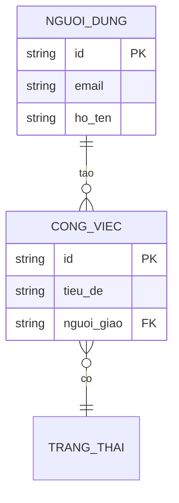

# Mô hình dữ liệu — <Tên App>

## 1. Danh sách thực thể
| Thực thể | Mô tả | Chức năng dùng (F..) |
|----------|-------|----------------------|
| <NgườiDùng> | <...> | F01, F02 |

## 2. Sơ đồ quan hệ (ERD)

## 3. Từ điển dữ liệu
### Thực thể: <NgườiDùng>
| Thuộc tính | Kiểu | Ràng buộc | Mô tả |
|------------|------|-----------|-------|
| id | chuỗi | PK | Định danh |
| email | chuỗi | duy nhất, bắt buộc | Email đăng nhập |
| ho_ten | chuỗi | bắt buộc | Họ tên hiển thị |

## 4. Quan hệ
| Từ | Đến | Loại | Ý nghĩa |
|----|-----|------|---------|
| NgườiDùng | CôngViệc | 1-n | Một người tạo nhiều công việc |

## 5. Ma trận CRUD (Thực thể × Chức năng)
> Soát thực thể mồ côi / chức năng thiếu chỗ lưu. C=Create, R=Read, U=Update, D=Delete.

| Thực thể \ Chức năng | F01 | F02 | F03 |
|---|---|---|---|
| NgườiDùng | C | R | U |
| CôngViệc | — | R | CRUD |

## 6. Ghi chú chuẩn hoá
- **Mức chuẩn hoá:** đạt 3NF.
- **Phi chuẩn hoá có chủ đích (nếu có):** <thực thể/cột + lý do, vd lưu `tong_tien` ở Đơn hàng để khỏi tính lại>.

## Thuật ngữ
| Thuật ngữ | Giải thích |
|-----------|-----------|
| ERD (Entity-Relationship Diagram) | Sơ đồ thực thể — quan hệ |
| Thực thể (Entity) | Đối tượng nghiệp vụ cần lưu trữ (vd Người dùng, Công việc) |
| PK / FK | Khoá chính (Primary Key) / Khoá ngoại (Foreign Key) |
| Cardinality | Số lượng quan hệ giữa hai thực thể: 1-1 / 1-n / n-n |
| 3NF | Dạng chuẩn thứ ba — loại dữ liệu lặp và phụ thuộc bắc cầu |
| CRUD | Bốn thao tác dữ liệu: Create / Read / Update / Delete |

> Từ điển đầy đủ toàn dự án: `docs/00-glossary.md`.
