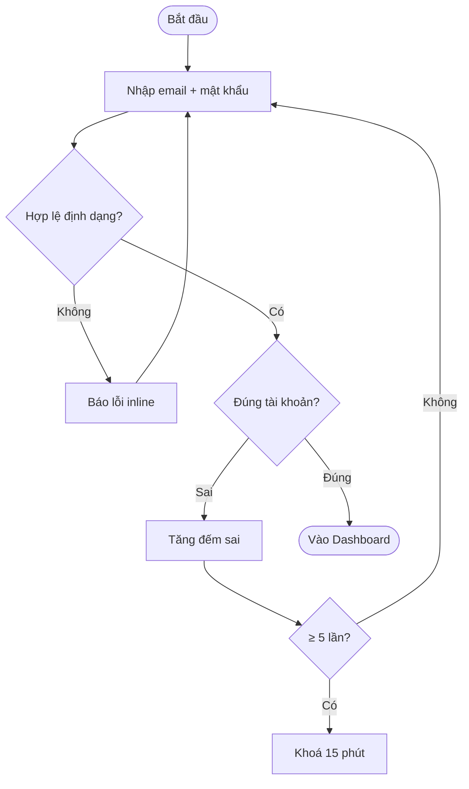
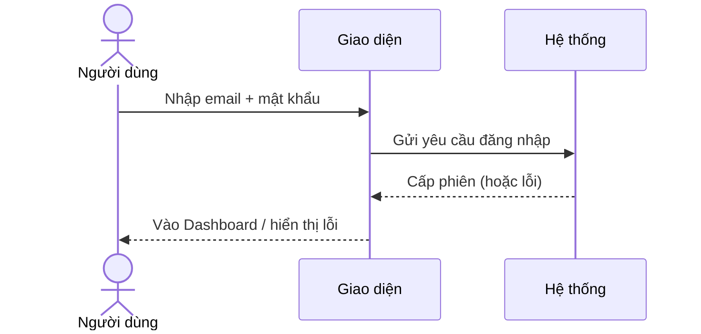
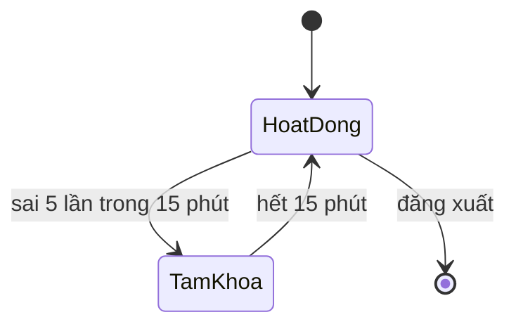
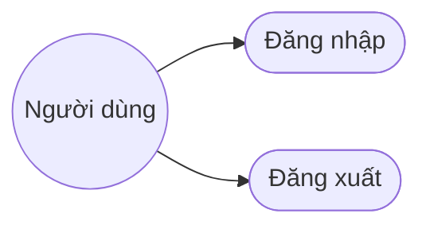
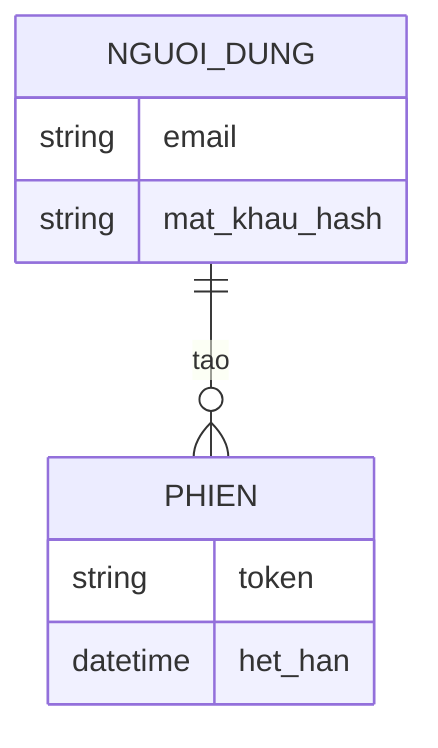

# Template 6 tài liệu phân tích màn hình

## ascii-screen.md
```
# Wireframe — <Tên màn hình>

+--------------------------------------------------+
| <Header / Logo>                      [Avatar ▾]  |
+--------------------------------------------------+
| <Vùng nội dung chính>                            |
|  [ Trường nhập ]                                 |
|  [ Nút hành động ]                               |
+--------------------------------------------------+

Chú thích các thành phần:
- <Thành phần>: <mục đích, hành vi>
```

## brainstorm.md
```
# Brainstorm — <Tên màn hình>

## Mục đích màn hình
<Người dùng đến đây để làm gì.>

## Thành phần & hành vi
- <Thành phần> → <hành vi/kết quả>

## Trạng thái & edge case
- Loading / rỗng / lỗi / không có quyền

## Câu hỏi mở
- <Điều cần làm rõ thêm>
```

## srs.md — Đặc tả yêu cầu giải pháp
```
# Đặc tả yêu cầu — <Tên màn hình> (Mã màn: S0x)

## Chức năng & truy vết nguồn
Trace: F0x → FR-0x → BR-0x.

## Yêu cầu chức năng (Functional)
| Mã | Yêu cầu (hệ thống phải...) | Trace F/FR | Acceptance criteria (đo được) | Ưu tiên |
|----|----------------------------|------------|-------------------------------|---------|
| R-S0x-01 | <...> | F0x / FR-0x | <điều kiện chấp nhận kiểm chứng được> | Must |

## Yêu cầu phi chức năng (Non-functional)
| Mã | Loại | Yêu cầu đo được | Trace |
|----|------|-----------------|-------|
| R-S0x-N01 | Bảo mật/Hiệu năng/... | <...> | NFR-0x / BR-0x |

## Quy tắc nghiệp vụ (Business Rules)
| Mã | Quy tắc | Trace |
|----|---------|-------|
| BRule-S0x-01 | <vd: chỉ cho đặt lịch trong giờ làm việc 8:00–17:00> | R-S0x-01 |

## Yêu cầu dữ liệu — Validation từng field (BẮT BUỘC ghi cụ thể)
| Field | Kiểu | Bắt buộc | Định dạng/Ràng buộc | Min/Max | Thông báo lỗi |
|-------|------|----------|---------------------|---------|---------------|
| email | chuỗi | Có | đúng định dạng email | ≤ 254 ký tự | "Email không hợp lệ" |
| mat_khau | chuỗi | Có | ≥1 chữ + ≥1 số | 8–64 ký tự | "Mật khẩu tối thiểu 8 ký tự gồm chữ và số" |

- Đầu ra: <dữ liệu/kết quả màn trả về>

## Sơ đồ luồng (Flow)
Vẽ MỌI luồng của màn hình bằng Mermaid; mỗi luồng chọn loại sơ đồ phù hợp (bảng & ví dụ ở "Hướng dẫn sơ đồ" ngay dưới template này). Mỗi luồng = 1 tiêu đề + 1 khối mermaid.
- <Tên luồng 1> — <Activity / Sequence / State / Use case>
- <Tên luồng 2> — <...>

## Mô hình dữ liệu màn hình (ERD)
ERD các thực thể màn này đụng tới (trích từ 05-data-model.md nếu có) — 1 khối mermaid erDiagram.

## Thuật ngữ
| Thuật ngữ | Giải thích |
|-----------|-----------|
| R-S (yêu cầu cấp màn) | Yêu cầu của riêng màn này (R-S0x-01…), truy vết F/FR |
| BRule (Business Rule) | Quy tắc nghiệp vụ áp cho màn (BRule-S0x-01…) |
| <thuật ngữ nghiệp vụ của màn> | <giải thích ngắn — điền theo màn> |

> Từ điển đầy đủ toàn dự án: `docs/00-glossary.md`.
```

### Hướng dẫn sơ đồ cho srs (cho mục "Sơ đồ luồng" & "ERD")

Chọn loại sơ đồ theo bản chất luồng:

| Loại luồng trong màn | Sơ đồ Mermaid |
|---|---|
| Tổng quan tác nhân ↔ chức năng | Use case → `flowchart LR` |
| Quy trình nhiều bước, có rẽ nhánh/quyết định | Activity → `flowchart TD` |
| Trao đổi người dùng ↔ hệ thống ↔ dịch vụ ngoài | Sequence → `sequenceDiagram` |
| Đối tượng/màn có nhiều trạng thái chuyển đổi | State → `stateDiagram-v2` |
| Dữ liệu màn đụng tới | ERD → `erDiagram` |

**Activity (flowchart):**


**Sequence:**


**State:**


**Use case (flowchart):**


**ERD:**


## usecase.md (Use Cases & Scenarios)
```
# Use case — <Tên màn hình>

## UC-S0x-01: <Tên use case>
- Tác nhân (actor): <...>
- Trigger (kích hoạt): <sự kiện bắt đầu>
- Tiền điều kiện: <...>
- Luồng chính (happy path):
  1. <bước>
  2. <bước>
- Luồng thay thế / ngoại lệ:
  - <điều kiện> → <xử lý>
- Hậu điều kiện (postcondition): <...>
- Đảm bảo (guarantees): thành công <...> / tối thiểu <...>
- Trace: R-S0x-01
```

## userstory.md (User Story — INVEST + Given-When-Then)
```
# User story — <Tên màn hình>

## US-S0x-01: <Tên màn hình> - <Nội dung title>
Là <vai trò>, tôi muốn <mục tiêu>, để <giá trị>.

> Heading mỗi user story theo đúng format `US-S0x-NN: <Tên màn hình> - <Nội dung title>` (tên màn hình tiếng Việt + " - " + tiêu đề ngắn của story).

- Trace: R-S0x-01 / F0x
- Story point: <1/2/3/5/8>
- Tiêu chí chấp nhận (Given-When-Then):
  - GWT-1: **Given** <bối cảnh>, **When** <hành động>, **Then** <kết quả>.
  - GWT-2: **Given** <...>, **When** <...>, **Then** <...>.
- INVEST: [ ] Independent [ ] Negotiable [ ] Valuable [ ] Estimable [ ] Small [ ] Testable
```

## design-spec.md — UI brief cho Designer
> Mô tả layout bằng chữ (không vẽ ASCII), không quy định mã màu/font cụ thể, không dùng từ dev-centric.
```
# Design Spec — <Tên màn hình> (Mã màn: S0x)

## 1. Tổng quan UX
- Mục tiêu UX: <trải nghiệm hướng tới — vd thao tác nhanh, cảm giác an toàn>
- Thiết bị mục tiêu: <Mobile / Web / Desktop> (mặc định mobile-first)
- User flow tóm tắt: [Màn trước] → [Màn này] → [Màn sau]

## 2. Cấu trúc layout (anatomy)
- Header: <gồm gì>
- Body / nội dung chính: <các block thông tin>
- Footer / điều hướng dưới: <gồm gì>

## 3. Component & dữ liệu
| Component | Loại | Mô tả / Logic | Ràng buộc (validation) | Trace |
|-----------|------|---------------|------------------------|-------|
| <Khung tìm kiếm> | Input | <...> | <tối đa 50 ký tự> | R-S0x-01 |
| <Nút Thanh toán> | Primary CTA | <chuyển màn Checkout> | <disable khi giỏ rỗng> | R-S0x-02 |

## 4. Trạng thái giao diện (UI States)
- ⚪ Empty: <hiển thị gì khi chưa có dữ liệu>
- 🔄 Loading: <skeleton / spinner>
- 🔴 Error: <thông báo lỗi ở đâu, ra sao>
- 🟢 Success: <toast / modal>

## 5. CTA & Copywriting (microcopy)
- CTA Primary: `<...>` · CTA Secondary: `<...>`
- Title: `<...>` · Helper text: `<...>`
- Wording lỗi/thành công: `<chính xác>`

## 6. Edge case (xử lý UX)
- <rớt mạng khi submit> → <giữ dữ liệu đã nhập, snackbar "Lỗi kết nối">
- <dữ liệu quá dài> → <cắt "..." + tooltip khi hover>

## 7. Animation & chuyển cảnh (BẮT BUỘC)
> Đặc tả CẢ hai nhóm dưới (xem "Animation chuyển cảnh" trong `conventions.md`). Duration/easing lấy từ Motion token `07-design-system.md` nếu có; enter = `ease-out`, exit = `ease-in`; tôn trọng `prefers-reduced-motion`.

**Chuyển màn (page transition) — vào/ra khi điều hướng:**
| Hướng | Màn lân cận | Hiệu ứng | Thời lượng · easing |
|-------|-------------|----------|---------------------|
| Vào (enter) | ← [Màn trước] | <vd slide-in từ phải + fade> | 250ms · ease-out |
| Ra (exit)   | → [Màn sau]   | <vd fade-out + scale 0.98> | 200ms · ease-in |

**Chuyển section nội màn (in/out) — panel/modal/tab/list/accordion/toast:**
| Thành phần | Sự kiện | Hiệu ứng IN | Hiệu ứng OUT | Thời lượng · easing |
|-----------|---------|-------------|--------------|---------------------|
| <Modal xác nhận> | mở / đóng | fade + scale-up | fade + scale-down | 200ms · ease-out/in |
| <Danh sách kết quả> | tải xong / xoá | stagger fade + slide-up | fade-out | 150ms · ease-out |

## 8. Ghi chú cho Designer
- Accessibility: <độ tương phản, cỡ chữ, thứ tự focus>
```
