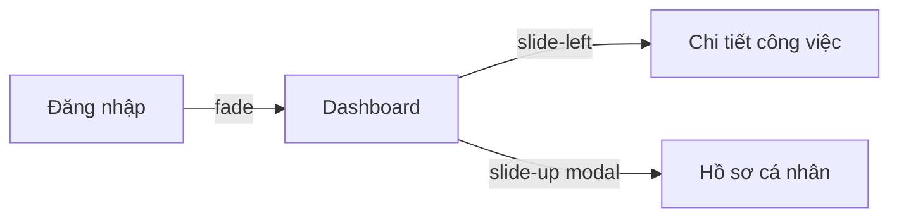

# Tổng quan màn hình — <Tên App>

## Danh sách màn hình

| Mã | Màn hình | Nhóm | Chức năng liên quan | Mô tả ngắn |
|----|----------|------|---------------------|------------|
| S01 | Đăng nhập | Authentication | F01 | <...> |
| S02 | Dashboard | Dashboard | F03, F04 | <...> |

## Ma trận CRUD-to-Screen (soát độ phủ màn hình)

> Mỗi thực thể quản lý chính cần đủ bộ màn theo thao tác. Ô trống = lỗ hổng cần giải thích.

| Thực thể \ Loại màn | List/Search | Detail | Create | Edit |
|---|---|---|---|---|
| <Thực thể A> | S02 | S03 | S04 | S04 (dùng chung form) |
| <Thực thể B> | S05 | S06 | S07 | — (chỉ đọc) |

## Sơ đồ điều hướng
> Mỗi cạnh ghi kèm **kiểu chuyển cảnh** (vd fade / slide-left / slide-up modal); chi tiết animation in/out đặc tả ở `design-spec.md` mục 7 của từng màn.

## Map chức năng ↔ màn hình
| Chức năng | Màn hình |
|-----------|----------|
| F01 | S01 |
| F03 | S02 |

## Thuật ngữ
| Thuật ngữ | Giải thích |
|-----------|-----------|
| S (Screen) | Mã màn hình (S01…) |
| F (Function) | Mã chức năng, truy vết về FR/BR |
| CRUD-to-Screen | Soát mỗi thực thể có đủ bộ màn List / Detail / Create / Edit |
| User Journey | Hành trình người dùng từ điểm vào tới mục tiêu, dùng để phát hiện màn thiếu |

> Từ điển đầy đủ toàn dự án: `docs/00-glossary.md`.
