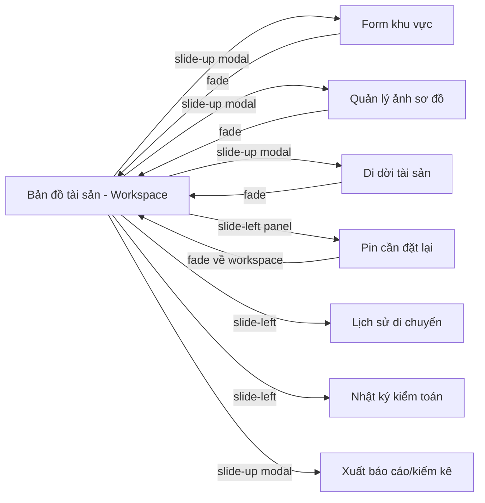

# Tổng quan màn hình — Quản lý vị trí tài sản cố định

> Suy ra từ `docs/02-functions.md` (22 chức năng) bằng **User Journey Mapping** + **CRUD-to-Screen Coverage**.
> Đây là phân hệ **lấy bản đồ làm trung tâm**: màn hub **Bản đồ tài sản (S01)** kết hợp cây khu vực + sơ đồ mặt bằng + pin; các màn/modal vệ tinh phục vụ tạo/sửa, di dời, lịch sử, kiểm toán, báo cáo.

## Danh sách màn hình

| Mã | Màn hình | Nhóm | Chức năng liên quan | Mô tả ngắn |
|----|----------|------|---------------------|------------|
| S01 | Bản đồ tài sản (Workspace) | BanDoTaiSan | F04, F05, F09, F10, F11, F14, F16, F03 | Hub: cây khu vực (trái) + sơ đồ mặt bằng & pin (giữa) + ô tra cứu nhanh; gán vị trí (click sơ đồ), gỡ vị trí, xóa nút (dialog), di chuyển nút trong cây |
| S02 | Form khu vực (Tạo/Sửa nút) | BanDoTaiSan | F01, F02 | Modal tạo mới / chỉnh sửa một nút khu vực (Tên bắt buộc; mã, loại, nút cha tùy chọn) |
| S03 | Quản lý ảnh sơ đồ mặt bằng | BanDoTaiSan | F06, F07, F08 | Modal tải lên / thay / xóa ảnh sơ đồ (PNG/JPG ≤ 10 MB) cho nút khu vực đang chọn |
| S04 | Di dời tài sản | BanDoTaiSan | F12, F13 | Form di dời (đơn & hàng loạt): chọn đích (bắt buộc) + lý do (tùy chọn); chọn tài sản lẻ hoặc cả vị trí cũ |
| S05 | Danh sách pin cần đặt lại | BanDoTaiSan | F15 | Liệt kê pin bị đánh dấu "cần đặt lại vị trí" (sau khi thay ảnh, pin tràn ngoài); đặt lại tọa độ |
| S06 | Lịch sử di chuyển tài sản | LichSu | F17 | Xem chuỗi vị trí cũ → mới của một tài sản (người thực hiện, thời điểm, lý do) |
| S07 | Nhật ký kiểm toán | LichSu | F19 | Tra & lọc bản ghi nhật ký kiểm toán mọi thao tác gán/di dời/xóa |
| S08 | Xuất báo cáo / kiểm kê | — (XuatBaoCao) | F20 | Cấu hình phạm vi và xuất Excel (.xlsx) danh sách tài sản kèm vị trí |

> **Chức năng nền (không có màn riêng):** F18 Ghi nhật ký kiểm toán (tự động khi gán/di dời/xóa) · F21 Phân quyền theo vai trò (thực thi ở mọi màn) · F22 Khóa tài sản khi đang sửa (thực thi nền khi mở S04/gán ở S01).

## Ma trận CRUD-to-Screen (soát độ phủ màn hình)

> Mỗi thực thể quản lý chính cần đủ bộ màn theo thao tác. Ô trống = lỗ hổng cần giải thích.

| Thực thể \ Loại màn | List/Search | Detail | Create | Edit |
|---|---|---|---|---|
| Nút khu vực | S01 (cây) | S01 (panel chi tiết) | S02 | S02 (dùng chung form) |
| Sơ đồ mặt bằng | S01 (hiển thị) | S01 (khung sơ đồ) | S03 | S03 (dùng chung) |
| Vị trí / Pin tài sản | S01 (tra cứu + pin) | S01 (popup pin) → S06 | S01 (click → chọn tài sản) | S04 (di dời) · S05 (đặt lại) |
| Lịch sử di chuyển | S06 | S06 | — (tự sinh khi di dời) | — (luật: bất biến) |
| Nhật ký kiểm toán | S07 | S07 | — (tự ghi) | — (luật: append-only) |

## Sơ đồ điều hướng
> Mỗi cạnh ghi kèm **kiểu chuyển cảnh**; chi tiết animation in/out đặc tả ở `design-spec.md` mục 7 của từng màn.

## Map chức năng ↔ màn hình
| Chức năng | Màn hình |
|-----------|----------|
| F01 Tạo nút khu vực | S02 |
| F02 Sửa nút khu vực | S02 |
| F03 Xóa nút khu vực | S01 (dialog xác nhận) |
| F04 Xem/duyệt cây khu vực | S01 |
| F05 Di chuyển nút trong cây | S01 |
| F06 Tải lên ảnh sơ đồ | S03 |
| F07 Thay ảnh sơ đồ | S03 |
| F08 Xóa ảnh sơ đồ | S03 |
| F09 Xem sơ đồ mặt bằng | S01 |
| F10 Gom cụm / lọc pin | S01 |
| F11 Gán vị trí tài sản | S01 |
| F12 Di dời tài sản (đơn) | S04 |
| F13 Di dời hàng loạt | S04 |
| F14 Gỡ vị trí tài sản | S01 (dialog) |
| F15 Đặt lại vị trí pin | S05 |
| F16 Tra cứu nhanh tài sản | S01 |
| F17 Xem lịch sử di chuyển | S06 |
| F18 Ghi nhật ký kiểm toán | — (nền, tự động) |
| F19 Xem nhật ký kiểm toán | S07 |
| F20 Xuất báo cáo / kiểm kê | S08 |
| F21 Phân quyền theo vai trò | — (nền, mọi màn) |
| F22 Khóa tài sản khi đang sửa | — (nền) |

## Thuật ngữ
| Thuật ngữ | Giải thích |
|-----------|-----------|
| S (Screen) | Mã màn hình (S01…) |
| F (Function) | Mã chức năng, truy vết về FR/BR |
| CRUD-to-Screen | Soát mỗi thực thể có đủ bộ màn List / Detail / Create / Edit |
| User Journey | Hành trình người dùng từ điểm vào tới mục tiêu, dùng để phát hiện màn thiếu |
| Workspace (hub) | Màn trung tâm tích hợp nhiều chức năng (cây + sơ đồ + pin) làm điểm vào chính |

> Từ điển đầy đủ toàn dự án: `docs/00-glossary.md`.
