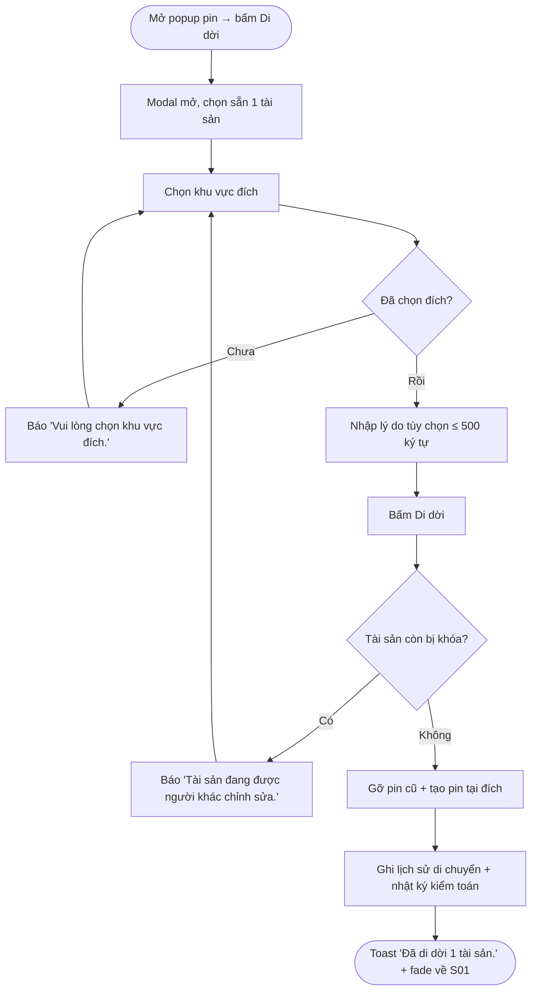
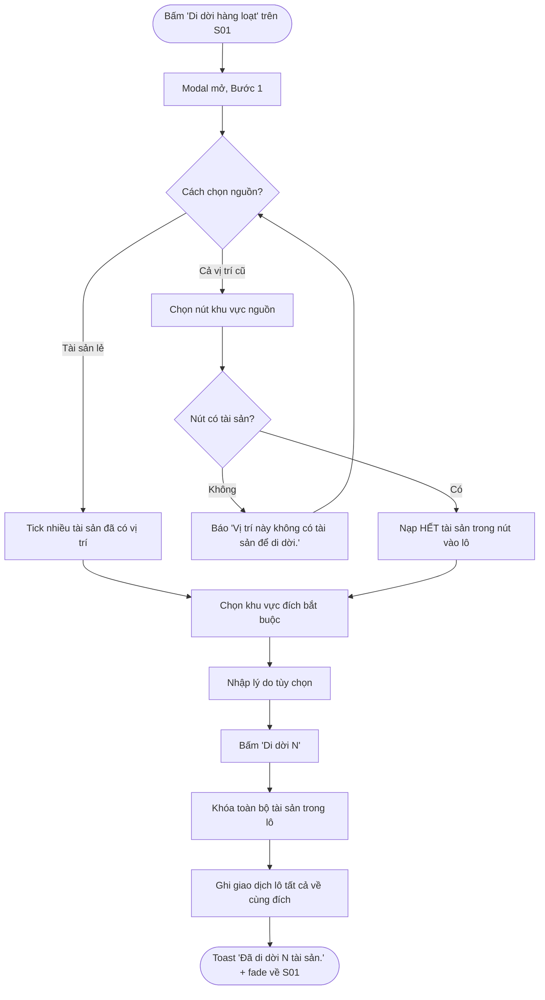
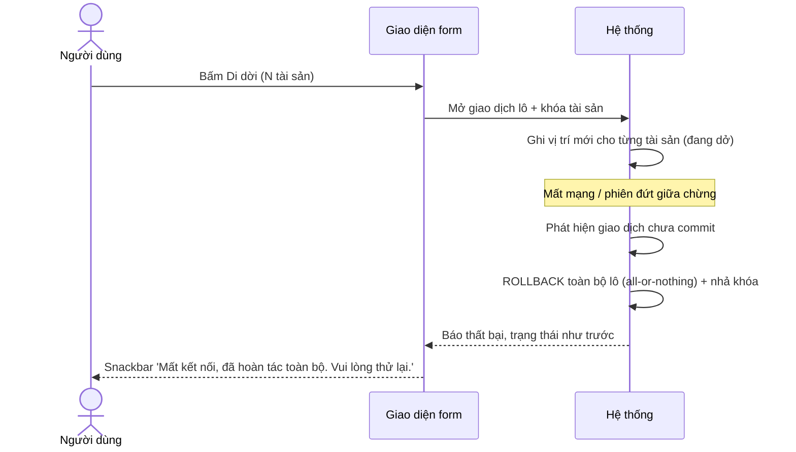
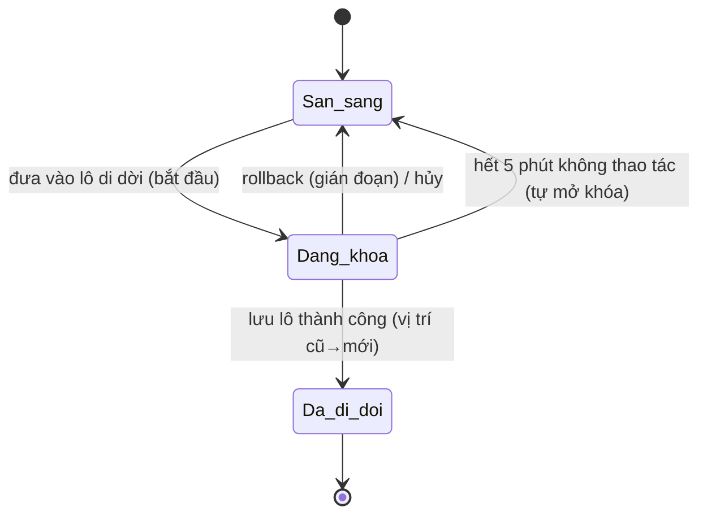
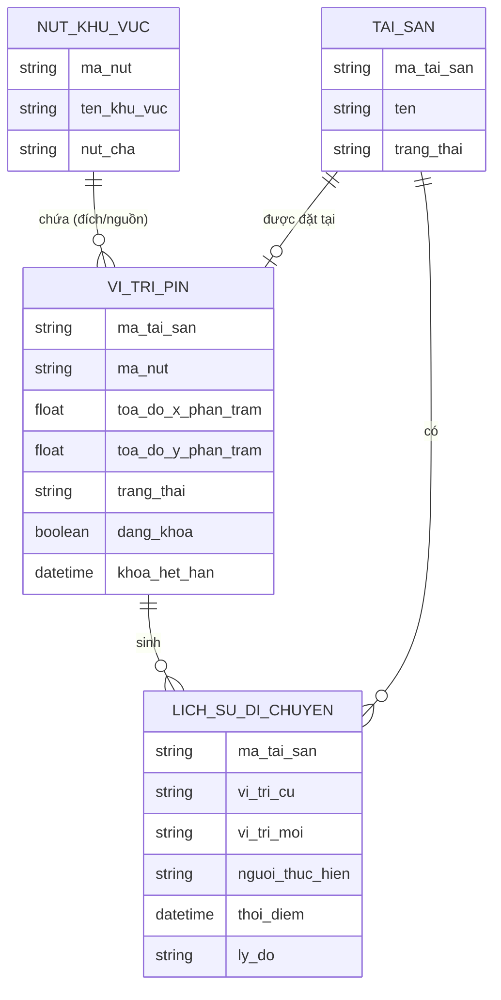

# Đặc tả yêu cầu — Di dời tài sản (đơn & hàng loạt) (Mã màn: S04)

## Chức năng & truy vết nguồn
Form di dời (modal trượt lên từ Bản đồ tài sản — S01) phục vụ hai chức năng. Trace:
- F12 Di dời tài sản (đơn) → FR-05 → BR-03
- F13 Di dời hàng loạt → FR-06 → BR-03

Quy tắc nghiệp vụ nền liên quan: BRule-02 (gán cho tài sản đã có vị trí = di dời, ghi lịch sử), BRule-05 (khóa tài sản đang sửa, mở sau 5 phút), BRule-07 (di dời hàng loạt → cùng một đích), BRule-08 (đích bắt buộc, lý do tùy chọn); giả định GĐ-R4 (gián đoạn → rollback toàn bộ lô).

## Yêu cầu chức năng (Functional)
| Mã | Yêu cầu (hệ thống phải...) | Trace F/FR | Acceptance criteria (đo được) | Ưu tiên |
|----|----------------------------|------------|-------------------------------|---------|
| R-S04-01 | Cho phép di dời **một** tài sản đã có vị trí qua form: chọn đích (bắt buộc) + lý do (tùy chọn) | F12 / FR-05 | Vào từ popup pin → modal mở với đúng 1 tài sản chọn sẵn; chọn đích + bấm Di dời → vị trí tài sản cập nhật về đích; nút Di dời tắt khi chưa chọn đích | Must |
| R-S04-02 | Cho phép **di dời hàng loạt** nhiều tài sản lẻ về cùng một đích | F13 / FR-06 | Người dùng tick nhiều tài sản đã có vị trí qua ô tìm; chọn đích; bấm Di dời → tất cả tài sản trong lô chuyển về đúng đích đã chọn | Must |
| R-S04-03 | Cho phép chọn nguồn theo **cả vị trí cũ** để lấy hết tài sản trong nút đó | F13 / FR-06 | Chọn một nút khu vực nguồn → hệ thống nạp **toàn bộ** tài sản trong nút vào lô; số đếm khớp số tài sản thực có | Must |
| R-S04-04 | Bắt buộc chọn đúng **một** khu vực/vị trí đích cho cả lô | F12, F13 / FR-05, FR-06 | Không chọn đích → không cho lưu, báo "Vui lòng chọn khu vực đích."; mọi tài sản trong lô về cùng đích (BRule-07) | Must |
| R-S04-05 | Cho nhập **lý do** di dời tùy chọn, tối đa 500 ký tự | F12, F13 / FR-05 | Bỏ trống vẫn lưu được; nhập > 500 ký tự bị chặn; lý do được lưu vào lịch sử di chuyển | Must |
| R-S04-06 | **Tự ghi người thực hiện + thời điểm** cho mỗi di dời | F12, F13 / FR-05 | Người dùng không nhập; bản ghi lịch sử ghi đúng người đăng nhập + dấu thời gian khi lưu | Must |
| R-S04-07 | Mỗi di dời sinh một bản ghi **lịch sử di chuyển** (vị trí cũ → mới) và một bản ghi **nhật ký kiểm toán** | F12, F13 / FR-05, FR-07 | Sau di dời: tài sản có thêm bản ghi lịch sử với vị trí cũ, vị trí mới, người, thời điểm, lý do (nếu có); nhật ký kiểm toán có bản ghi tương ứng | Must |
| R-S04-08 | **Khóa** mọi tài sản trong lô khi đang di dời; loại tài sản đang bị người khác khóa | F13 / FR-06, FR-11 | Bắt đầu di dời → các tài sản trong lô bị khóa cho người khác; tài sản đã bị khóa hiện icon khóa, không tick được; lô có tài sản khóa → hỏi bỏ qua phần còn lại | Should |
| R-S04-09 | Xử lý di dời lô theo **all-or-nothing**: gián đoạn → **rollback toàn bộ lô** | F13 / FR-06 | Mất mạng/đóng phiên giữa chừng → không tài sản nào đổi vị trí; sau khi khôi phục, trạng thái như trước khi di dời; báo lỗi rõ ràng | Must |
| R-S04-10 | Cập nhật **vị trí cũ** của tài sản (xóa pin cũ) và tạo **pin mới** tại đích | F12, F13 / FR-05 | Sau di dời thành công, pin tài sản biến mất ở khu vực cũ và xuất hiện trong khu vực đích; mỗi tài sản vẫn chỉ 1 vị trí (BRule-01) | Must |

## Yêu cầu phi chức năng (Non-functional)
| Mã | Loại | Yêu cầu đo được | Trace |
|----|------|-----------------|-------|
| R-S04-N01 | Toàn vẹn giao dịch | Di dời hàng loạt là **một giao dịch all-or-nothing**: gián đoạn (mất mạng) → **rollback toàn bộ lô**, không để dữ liệu nửa vời | GĐ-R4 / BR-03 |
| R-S04-N02 | Toàn vẹn đồng thời | Tài sản đang di dời bị **khóa**; khóa **tự mở sau 5 phút** không thao tác; thao tác lên tài sản đang khóa bị từ chối với thông báo rõ | NFR-05 / BR-03 |
| R-S04-N03 | Hiệu năng | Di dời hàng loạt tới **500 tài sản** trong một lô hoàn tất trong **< 5 giây**; có thanh tiến trình khi vượt 1 giây | NFR-01 / BR-03 |
| R-S04-N04 | Bảo mật & truy vết | Mọi di dời ghi **nhật ký kiểm toán** đầy đủ (người · hành động · đối tượng · thời gian · vị trí cũ→mới); cả 2 vai trò được phép, áp kiểm soát truy cập | NFR-03 / BR-03 |

## Quy tắc nghiệp vụ (Business Rules)
| Mã | Quy tắc | Trace |
|----|---------|-------|
| BRule-S04-01 | Một thao tác di dời hàng loạt chuyển **tất cả** tài sản đã chọn về **cùng một đích** | R-S04-04 (BRule-07) |
| BRule-S04-02 | Gán vị trí cho tài sản **đã có vị trí** được coi là **di dời** và **luôn sinh bản ghi lịch sử di chuyển** | R-S04-07 (BRule-02) |
| BRule-S04-03 | **Đích bắt buộc**, **lý do tùy chọn** (≤ 500 ký tự) | R-S04-04, R-S04-05 (BRule-08) |
| BRule-S04-04 | Khi đang di dời, **khóa** các tài sản trong lô; khóa **tự mở sau 5 phút**; không thao tác được lên tài sản đang bị người khác khóa | R-S04-08, R-S04-N02 (BRule-05) |
| BRule-S04-05 | Di dời hàng loạt **all-or-nothing**: gián đoạn → **rollback toàn bộ lô** | R-S04-09, R-S04-N01 (GĐ-R4) |
| BRule-S04-06 | Ô chọn tài sản nguồn chỉ liệt kê tài sản **đã có vị trí** (chỉ tài sản đã có vị trí mới "di dời" được) | R-S04-02, R-S04-03 |
| BRule-S04-07 | Đích di dời **không được trùng** vị trí hiện tại của tài sản trong lô (nếu trùng toàn bộ → không có gì để đổi) | R-S04-04 |

## Yêu cầu dữ liệu — Validation từng field
| Field | Kiểu | Bắt buộc | Định dạng/Ràng buộc | Min/Max | Thông báo lỗi |
|-------|------|----------|---------------------|---------|---------------|
| khu_vuc_dich | tham chiếu nút khu vực | Có | phải là một nút khu vực hợp lệ trong cây; đúng 1 nút | — | "Vui lòng chọn khu vực đích." |
| ly_do | chuỗi | Không | văn bản tự do | 0–500 ký tự | "Lý do tối đa 500 ký tự." |
| danh_sach_tai_san | danh sách tham chiếu | Có | mỗi tài sản phải **đã có vị trí** và không bị người khác khóa | ≥ 1 tài sản | "Chọn ít nhất một tài sản để di dời." |
| cach_chon_nguon | lựa chọn | Có (khi hàng loạt) | "tài sản lẻ" hoặc "cả vị trí cũ" | — | — |
| vi_tri_cu_nguon | tham chiếu nút khu vực | Có (khi chọn cả vị trí cũ) | nút phải chứa ≥ 1 tài sản | — | "Vị trí này không có tài sản để di dời." |

- Đầu ra: vị trí mới của các tài sản trong lô (pin cũ gỡ, pin mới tại đích); một bản ghi lịch sử di chuyển cho mỗi tài sản (vị trí cũ→mới, người, thời điểm, lý do); một bản ghi nhật ký kiểm toán cho mỗi di dời; toast "Đã di dời {n} tài sản.". Nếu gián đoạn → không thay đổi gì (rollback).

## Sơ đồ luồng (Flow)

### Luồng 1 — Di dời tài sản đơn (Activity)

### Luồng 2 — Di dời hàng loạt theo vị trí cũ (Activity)

### Luồng 3 — Rollback khi gián đoạn (Sequence)

### Luồng 4 — Trạng thái khóa tài sản khi di dời (State)

## Mô hình dữ liệu màn hình (ERD)

## Thuật ngữ
| Thuật ngữ | Giải thích |
|-----------|-----------|
| R-S (yêu cầu cấp màn) | Yêu cầu của riêng màn này (R-S04-01…), truy vết F/FR |
| BRule (Business Rule) | Quy tắc nghiệp vụ áp cho màn (BRule-S04-01…) |
| Di dời | Đổi vị trí của tài sản đã có vị trí, sinh bản ghi lịch sử di chuyển |
| Di dời hàng loạt | Di dời nhiều tài sản cùng lúc về cùng một đích |
| Vị trí đích | Khu vực/vị trí mới mà tài sản được chuyển tới (bắt buộc khi di dời) |
| All-or-nothing (toàn bộ hoặc không) | Giao dịch lô: hoặc mọi tài sản đổi vị trí, hoặc không tài sản nào (rollback khi gián đoạn) |
| Rollback (hoàn tác) | Khôi phục trạng thái trước giao dịch khi lô bị gián đoạn |
| Khóa khi đang sửa | Tạm khóa tài sản đang di dời chống thao tác đồng thời; tự mở sau 5 phút |
| Lịch sử di chuyển | Chuỗi bản ghi vị trí cũ → mới của một tài sản (ai, khi nào, lý do) |
| Nhật ký kiểm toán | Bản ghi ai – làm gì – khi nào cho mọi thao tác gán/di dời/xóa |

> Từ điển đầy đủ toàn dự án: `docs/00-glossary.md`.
