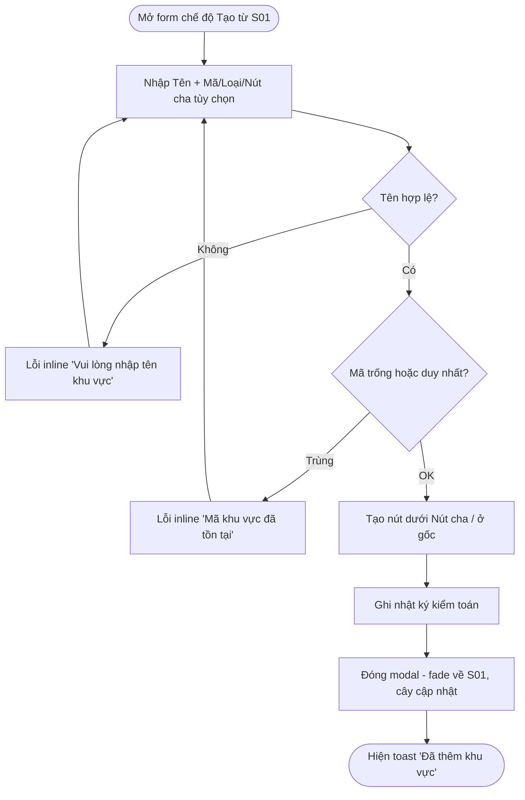
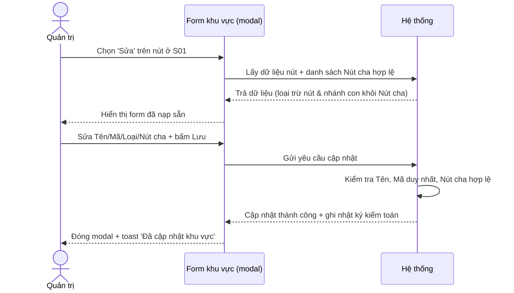
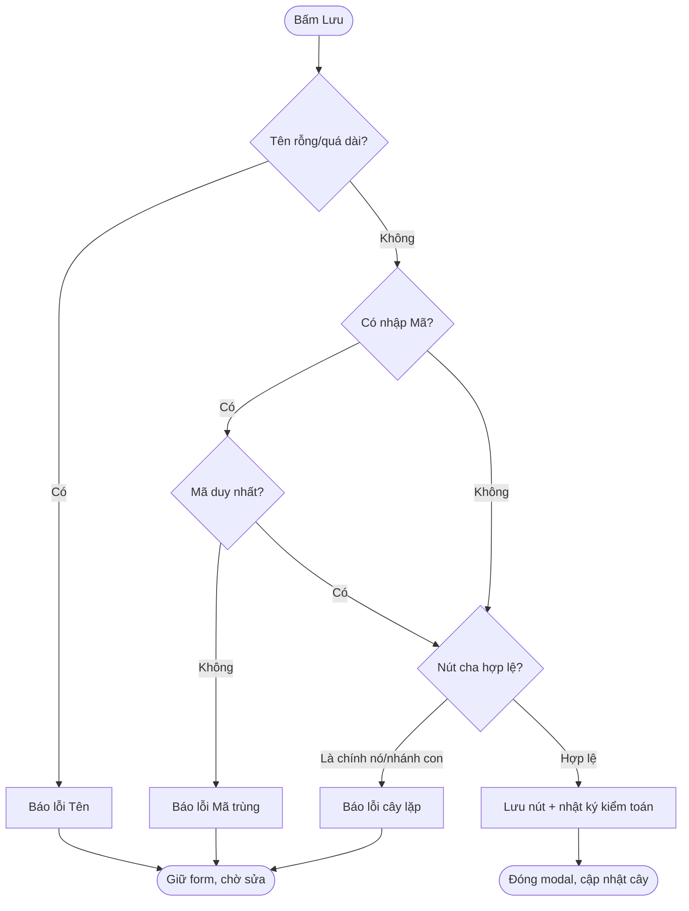
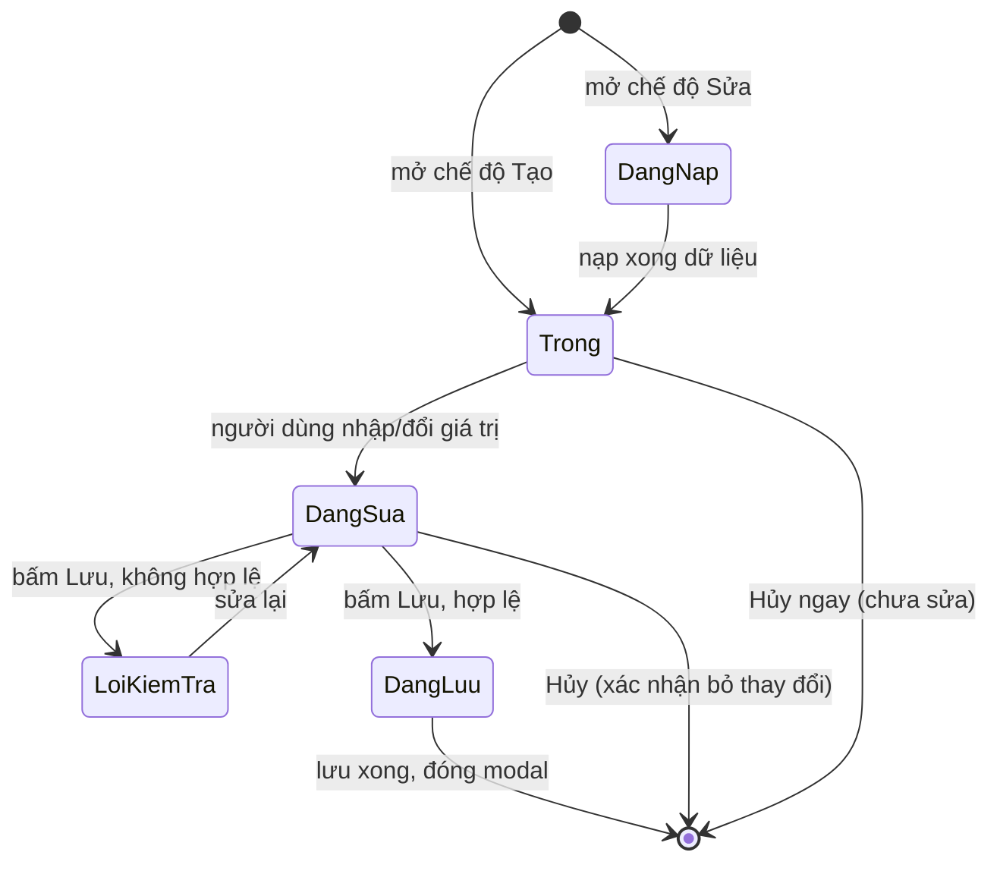
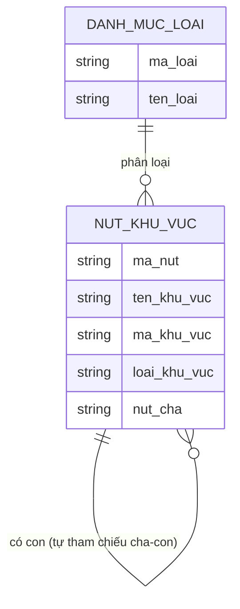

# Đặc tả yêu cầu — Form khu vực (Tạo/Sửa nút) (Mã màn: S02)

## Chức năng & truy vết nguồn
Modal nhập liệu dùng chung cho hai chức năng tạo/sửa nút khu vực, mở dạng slide-up từ màn Bản đồ tài sản (S01 — Workspace). Trace:
- F01 Tạo nút khu vực → FR-01 → BR-04
- F02 Sửa nút khu vực → FR-01 → BR-04

> Quy tắc nền liên quan: BRule-10 (Tên bắt buộc), BRule-06 (chặn cây lặp), BRule-09 (chỉ Quản trị quản cấu trúc).

## Yêu cầu chức năng (Functional)
| Mã | Yêu cầu (hệ thống phải...) | Trace F/FR | Acceptance criteria (đo được) | Ưu tiên |
|----|----------------------------|------------|-------------------------------|---------|
| R-S02-01 | Mở form ở **chế độ Tạo** với các trường trống và Nút cha mặc định theo ngữ cảnh mở | F01 / FR-01 | Tiêu đề "Thêm khu vực"; Tên/Mã/Loại trống; nếu mở từ menu "Thêm con" của một nút → Nút cha đặt sẵn là nút đó; nếu mở từ "+ Thêm khu vực" ở gốc → Nút cha = "(Gốc)" | Must |
| R-S02-02 | Mở form ở **chế độ Sửa** với dữ liệu hiện có của nút được nạp sẵn | F02 / FR-01 | Tiêu đề "Sửa khu vực"; Tên/Mã/Loại/Nút cha hiển thị đúng giá trị hiện tại của nút trong < 1s | Must |
| R-S02-03 | Tạo nút khu vực mới khi lưu hợp lệ ở chế độ Tạo | F01 / FR-01 | Lưu hợp lệ → nút mới xuất hiện trong cây dưới đúng Nút cha (hoặc ở gốc); modal đóng; cây S01 cập nhật và bật nhánh chứa nút mới | Must |
| R-S02-04 | Cập nhật nút khu vực khi lưu hợp lệ ở chế độ Sửa | F02 / FR-01 | Lưu hợp lệ → Tên/Mã/Loại/Nút cha của nút cập nhật; nếu đổi Nút cha → nút chuyển sang nhánh mới; cây S01 cập nhật | Must |
| R-S02-05 | Bắt buộc và kiểm tra **Tên khu vực** trước khi lưu | F01, F02 / FR-01 | Tên rỗng/chỉ khoảng trắng → chặn lưu, lỗi inline dưới ô; Tên > 150 ký tự → chặn, báo lỗi; nút Lưu vô hiệu khi Tên trống | Must |
| R-S02-06 | Bảo đảm **Mã khu vực duy nhất** khi có nhập | F01, F02 / FR-01 | Mã nhập trùng mã của nút khác → chặn lưu, lỗi inline; bỏ trống → cho lưu (mã không bắt buộc); ở chế độ Sửa, giữ nguyên mã của chính nút không bị coi là trùng | Should |
| R-S02-07 | Cho chọn **Nút cha** từ cây khu vực; để trống = nút gốc | F01, F02 / FR-01 | Dropdown/cây liệt kê các nút hợp lệ; chọn một nút → nút mới/được sửa nằm dưới nút đó; để trống → tạo/đặt ở gốc | Must |
| R-S02-08 | **Chặn chọn Nút cha là chính nút đang sửa hoặc nhánh con của nó** (chống cây lặp) | F02 / FR-01 | Ở chế độ Sửa, danh sách Nút cha loại trừ chính nút và toàn bộ con-cháu; nếu cố gán (qua thao tác khác) → báo lỗi và chặn lưu | Must |
| R-S02-09 | Cho chọn **Loại khu vực** từ danh mục; để trống được | F01, F02 / FR-01 | Loại chọn từ danh mục (Site/Tòa/Tầng/Phòng/Khu); để trống → lưu được; loại không thuộc danh mục bị từ chối | Could |
| R-S02-10 | Đóng form không lưu qua Hủy / × / nền tối; cảnh báo nếu có thay đổi chưa lưu | F01, F02 / FR-01 | Chưa sửa gì → đóng ngay; đã sửa dữ liệu → hỏi "Bỏ thay đổi chưa lưu?"; xác nhận → đóng, không tạo/sửa nút | Should |

## Yêu cầu phi chức năng (Non-functional)
| Mã | Loại | Yêu cầu đo được | Trace |
|----|------|-----------------|-------|
| R-S02-N01 | Hiệu năng | Nạp dữ liệu nút vào form (chế độ Sửa) và danh sách Nút cha hiển thị trong **< 1 giây** | NFR-02 / BR-01 |
| R-S02-N02 | Bảo mật & truy vết | Chỉ vai trò **Quản trị** mở/lưu được form; thao tác tạo/sửa nút được ghi nhật ký kiểm toán đầy đủ | NFR-03 / BR-03 |
| R-S02-N03 | Khả dụng | Toàn bộ form thao tác được bằng bàn phím; lỗi inline đọc được bởi trình đọc màn hình; thứ tự focus Tên → Mã → Loại → Nút cha → Lưu | NFR-03 / BR-04 |

## Quy tắc nghiệp vụ (Business Rules)
| Mã | Quy tắc | Trace |
|----|---------|-------|
| BRule-S02-01 | Nút khu vực **bắt buộc có Tên**; Mã và Loại tùy chọn (kế thừa BRule-10) | R-S02-05, R-S02-09 |
| BRule-S02-02 | **Chặn đặt một nút làm con của chính nó hoặc của một nhánh con của nó** (tránh cây lặp; kế thừa BRule-06) | R-S02-08 |
| BRule-S02-03 | **Mã khu vực, nếu nhập, phải duy nhất** trong toàn cây khu vực | R-S02-06 |
| BRule-S02-04 | Để trống Nút cha = nút **gốc** (không có cha) | R-S02-07 |
| BRule-S02-05 | **Chỉ vai trò Quản trị** được tạo/sửa nút khu vực; Giám sát không có lối vào màn này (kế thừa BRule-09) | R-S02-N02 |

## Yêu cầu dữ liệu — Validation từng field (BẮT BUỘC ghi cụ thể)
| Field | Kiểu | Bắt buộc | Định dạng/Ràng buộc | Min/Max | Thông báo lỗi |
|-------|------|----------|---------------------|---------|---------------|
| ten_khu_vuc | chuỗi | Có | không rỗng sau khi trim (bỏ khoảng trắng đầu/cuối) | 1–150 ký tự | "Vui lòng nhập tên khu vực" / "Tên khu vực tối đa 150 ký tự" |
| ma_khu_vuc | chuỗi | Không | duy nhất toàn cây nếu nhập; cho phép chữ-số-gạch | ≤ 50 ký tự | "Mã khu vực đã tồn tại" / "Mã khu vực tối đa 50 ký tự" |
| loai_khu_vuc | danh mục | Không | thuộc danh mục {Site, Tòa, Tầng, Phòng, Khu} | — | "Loại khu vực không hợp lệ" |
| nut_cha | tham chiếu | Không | là một nút tồn tại; **không phải chính nút và không thuộc nhánh con** (chế độ Sửa) | — | "Không thể đặt khu vực vào chính nó hoặc nhánh con của nó" |

- Đầu ra: một nút khu vực được tạo mới hoặc cập nhật (Tên/Mã/Loại/Nút cha); cây khu vực ở S01 được render lại với nút mới/đã sửa; một bản ghi nhật ký kiểm toán cho thao tác tạo/sửa.

## Sơ đồ luồng (Flow)

### Luồng 1 — Tạo nút khu vực (Activity)

### Luồng 2 — Sửa nút khu vực (Sequence)

### Luồng 3 — Kiểm tra hợp lệ khi lưu (Activity)

### Luồng 4 — Trạng thái form (State)

## Mô hình dữ liệu màn hình (ERD)

## Thuật ngữ
| Thuật ngữ | Giải thích |
|-----------|-----------|
| R-S (yêu cầu cấp màn) | Yêu cầu của riêng màn này (R-S02-01…), truy vết F/FR |
| BRule (Business Rule) | Quy tắc nghiệp vụ áp cho màn (BRule-S02-01…) |
| Nút khu vực | Một phần tử trong cây khu vực (vd một tầng, một phòng) |
| Nút cha | Nút khu vực đứng trên một cấp, quyết định vị trí của nút trong cây; để trống = nút gốc |
| Nút gốc | Nút khu vực không có nút cha, nằm ở cấp trên cùng của cây |
| Loại khu vực | Phân loại nút khu vực theo danh mục (Site/Tòa/Tầng/Phòng/Khu) |
| Cây lặp | Lỗi cấu trúc khi một nút trở thành con của chính nó hoặc nhánh con của nó (vòng lặp cha-con) |

> Từ điển đầy đủ toàn dự án: `docs/00-glossary.md`.
