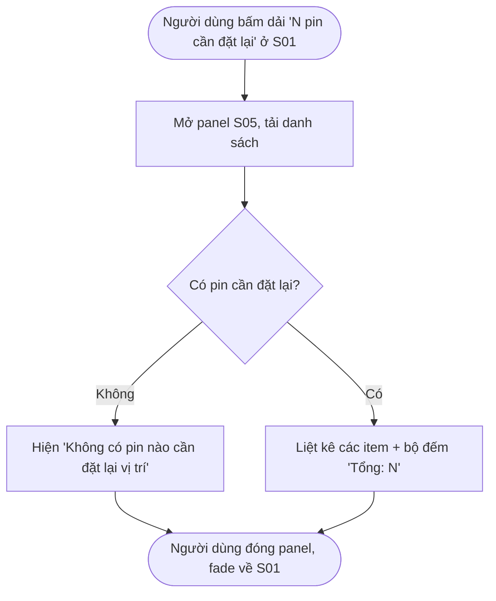
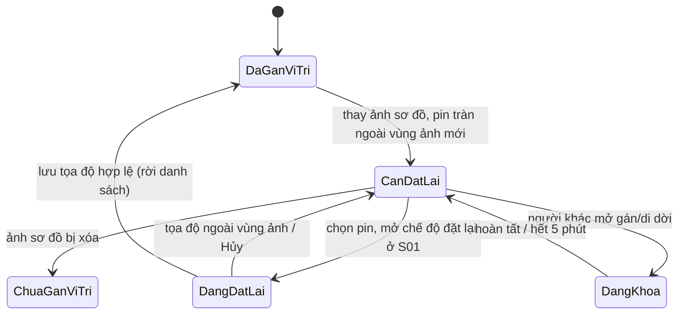
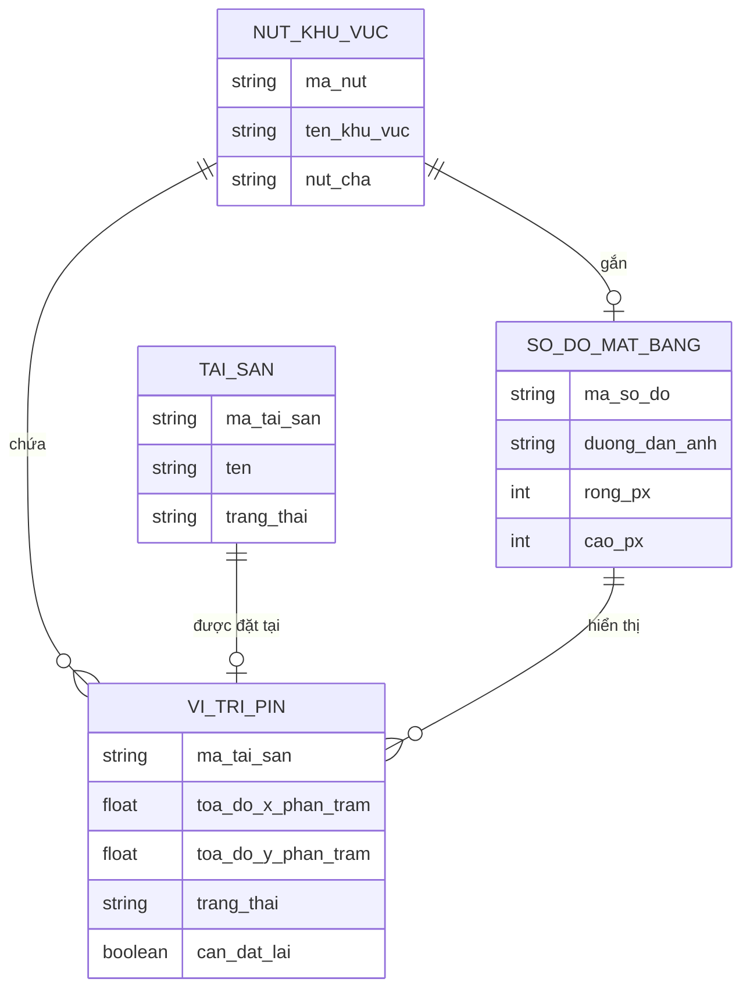

# Đặc tả yêu cầu — Danh sách pin cần đặt lại (Mã màn: S05)

## Chức năng & truy vết nguồn
Panel vệ tinh mở từ Bản đồ tài sản (Workspace, S01). Trace:
- F15 Đặt lại vị trí pin cần đặt lại → FR-02 (Quản lý ảnh sơ đồ mặt bằng) → BR-02 (Trực quan hóa bố trí tài sản)
- Liên quan: BRule-04 (giữ tọa độ tương đối khi thay ảnh), NFR-06 (pin lưu tọa độ tương đối %), giả định **GĐ-R2** (đánh dấu pin "cần đặt lại vị trí" khi tràn ngoài ảnh mới và liệt kê danh sách chờ).

> Ưu tiên chức năng: **Could** (theo F15). Cả vai trò Quản trị và Giám sát dùng được — đây là thao tác đặt/gán vị trí, không phải quản lý cấu trúc.

## Yêu cầu chức năng (Functional)
| Mã | Yêu cầu (hệ thống phải...) | Trace F/FR | Acceptance criteria (đo được) | Ưu tiên |
|----|----------------------------|------------|-------------------------------|---------|
| R-S05-01 | Liệt kê toàn bộ pin bị đánh dấu "cần đặt lại vị trí" trong panel mở từ S01 | F15 / FR-02 | Panel hiển thị mỗi pin một item gồm mã + tên tài sản, đường dẫn khu vực đầy đủ, tên sơ đồ chứa pin; chỉ liệt kê pin có trạng thái "cần đặt lại" | Should |
| R-S05-02 | Hiển thị bộ đếm tổng số pin cần đặt lại | F15 / FR-02 | Hiển thị "Tổng: N" khớp số item; cập nhật ngay khi một pin được đặt lại xong hoặc khi danh sách thay đổi | Should |
| R-S05-03 | Cho phép chọn một pin để mở sơ đồ tương ứng ở S01 và vào chế độ đặt lại tọa độ | F15 / FR-02 | Bấm [Đặt lại vị trí] trên item → panel đóng, S01 mở đúng sơ đồ chứa pin, pin được làm nổi, vào chế độ đặt lại (con trỏ đặt pin) | Should |
| R-S05-04 | Cho phép đặt lại tọa độ pin bằng click hoặc kéo pin vào vùng ảnh, lưu tọa độ tương đối (%) | F15 / FR-02 | Click/kéo điểm trong vùng ảnh → pin nhận tọa độ (x%, y%) trong 0–100; bấm Lưu → cập nhật vị trí, ghi nhật ký kiểm toán | Should |
| R-S05-05 | Bỏ trạng thái "cần đặt lại" của pin sau khi đặt lại thành công và gỡ khỏi danh sách | F15 / FR-02 | Lưu xong → pin chuyển về "đã có vị trí", rời khỏi danh sách S05, bộ đếm giảm 1; pin hiển thị bình thường trên sơ đồ | Should |
| R-S05-06 | Chặn lưu khi tọa độ đặt lại nằm ngoài vùng ảnh và báo lỗi rõ ràng | F15 / FR-02 | Điểm chọn ngoài 0–100% hoặc ngoài khung ảnh → báo "Vị trí nằm ngoài sơ đồ", không lưu, pin giữ trạng thái cần đặt lại | Should |
| R-S05-07 | Hiển thị trạng thái rỗng khi không còn pin nào cần đặt lại | F15 / FR-02 | Khi N = 0, panel hiện thông báo "Không có pin nào cần đặt lại vị trí" thay cho danh sách | Should |
| R-S05-08 | Cho cả Quản trị và Giám sát dùng panel và thao tác đặt lại | F15 / FR-09 | Cả hai vai trò mở được panel và đặt lại được vị trí; không yêu cầu quyền quản lý cấu trúc | Should |

## Yêu cầu phi chức năng (Non-functional)
| Mã | Loại | Yêu cầu đo được | Trace |
|----|------|-----------------|-------|
| R-S05-N01 | Hiệu năng | Tải và hiển thị danh sách pin cần đặt lại trong **< 2 giây**; mở sơ đồ đặt lại render trong **< 2 giây** | NFR-01 / BR-02 |
| R-S05-N02 | Khả dụng | Tọa độ đặt lại lưu dưới dạng **tọa độ tương đối (%)** để bền vững khi đổi kích thước hiển thị | NFR-06 / BR-02 |
| R-S05-N03 | Bảo mật & truy vết | Mỗi lần đặt lại vị trí ghi **nhật ký kiểm toán** đầy đủ (người · hành động · tài sản · vị trí cũ→mới · thời điểm) | NFR-03 / BR-03 |
| R-S05-N04 | Toàn vẹn đồng thời | Pin của tài sản đang bị người khác sửa bị **khóa**; nút Đặt lại vô hiệu, tự mở sau 5 phút | NFR-05 / BR-03 |

## Quy tắc nghiệp vụ (Business Rules)
| Mã | Quy tắc | Trace |
|----|---------|-------|
| BRule-S05-01 | Pin chỉ vào danh sách "cần đặt lại" khi tọa độ tương đối khiến pin **nằm ngoài vùng ảnh sơ đồ mới** (sau thay ảnh) | R-S05-01 |
| BRule-S05-02 | Tọa độ đặt lại phải nằm **trong vùng ảnh** (x%, y% trong 0–100 và trong khung ảnh) mới được lưu | R-S05-04, R-S05-06 |
| BRule-S05-03 | Đặt lại vị trí **không tạo bản ghi lịch sử di chuyển** (vị trí logic/khu vực không đổi, chỉ sửa tọa độ hiển thị), nhưng **ghi nhật ký kiểm toán** | R-S05-04, R-S05-N03 |
| BRule-S05-04 | Một pin sau khi đặt lại thành công **rời khỏi danh sách** cần đặt lại và bộ đếm giảm | R-S05-05 |
| BRule-S05-05 | Cả **Quản trị và Giám sát** đều được đặt lại vị trí pin (thao tác gán/đặt vị trí, không phải quản cấu trúc) | R-S05-08 |
| BRule-S05-06 | Nếu ảnh sơ đồ của pin bị **xóa**, pin về "chưa có vị trí" và **tự rời** danh sách cần đặt lại | R-S05-01 |

## Yêu cầu dữ liệu — Validation từng field
| Field | Kiểu | Bắt buộc | Định dạng/Ràng buộc | Min/Max | Thông báo lỗi |
|-------|------|----------|---------------------|---------|---------------|
| toa_do_moi_x | số (%) | Có (khi đặt lại) | trong vùng ảnh; phần trăm chiều rộng ảnh | 0–100 | "Vị trí nằm ngoài sơ đồ" |
| toa_do_moi_y | số (%) | Có (khi đặt lại) | trong vùng ảnh; phần trăm chiều cao ảnh | 0–100 | "Vị trí nằm ngoài sơ đồ" |
| pin_chon | tham chiếu | Có (khi đặt lại) | thuộc danh sách pin "cần đặt lại"; chưa bị khóa | — | "Tài sản đang được người khác chỉnh sửa. Vui lòng thử lại sau." |

- Đầu ra: danh sách pin cần đặt lại (mã/tên tài sản, đường dẫn khu vực, sơ đồ) + bộ đếm tổng; với mỗi pin đặt lại thành công: tọa độ tương đối mới được lưu, pin rời danh sách, nhật ký kiểm toán được ghi.

## Sơ đồ luồng (Flow)

### Luồng 1 — Xem danh sách pin cần đặt lại (Activity)


### Luồng 2 — Đặt lại vị trí 1 pin (Sequence)
```mermaid
sequenceDiagram
  actor U as Người dùng
  participant P as Panel S05
  participant W as Workspace S01
  participant BE as Hệ thống
  U->>P: Bấm [Đặt lại vị trí] trên một pin
  P->>W: Đóng panel, mở sơ đồ chứa pin + làm nổi pin
  W-->>U: Vào chế độ đặt lại (con trỏ đặt pin)
  U->>W: Click / kéo pin vào điểm trong vùng ảnh
  W->>W: Kiểm tra tọa độ trong 0–100% & trong khung ảnh
  alt Tọa độ hợp lệ
    U->>W: Bấm Lưu
    W->>BE: Gửi tọa độ tương đối mới (x%, y%)
    BE->>BE: Cập nhật pin, bỏ cờ 'cần đặt lại', ghi nhật ký kiểm toán
    BE-->>W: Thành công
    W-->>U: Toast 'Đã đặt lại vị trí pin'; pin rời danh sách, bộ đếm giảm
  else Tọa độ ngoài vùng ảnh
    W-->>U: Báo 'Vị trí nằm ngoài sơ đồ', không lưu
  end
```

### Luồng 3 — Trạng thái pin từ "cần đặt lại" → "đã đặt" (State)


## Mô hình dữ liệu màn hình (ERD)


## Thuật ngữ
| Thuật ngữ | Giải thích |
|-----------|-----------|
| R-S (yêu cầu cấp màn) | Yêu cầu của riêng màn này (R-S05-01…), truy vết F/FR |
| BRule (Business Rule) | Quy tắc nghiệp vụ áp cho màn (BRule-S05-01…) |
| Pin | Điểm đánh dấu vị trí một tài sản trên sơ đồ mặt bằng |
| Pin cần đặt lại vị trí | Pin có tọa độ tương đối khiến nó nằm ngoài vùng ảnh sơ đồ mới (sau thay ảnh), cần đặt lại tọa độ |
| Tọa độ tương đối | Vị trí pin lưu theo phần trăm (%) kích thước ảnh, giữ vị trí khi đổi ảnh/kích thước hiển thị |
| Sơ đồ mặt bằng | Ảnh bố trí của một khu vực, dùng để đính pin tài sản |
| Breadcrumb | Dải đường dẫn thể hiện vị trí một nút trong cây khu vực |
| Nhật ký kiểm toán | Bản ghi ai – làm gì – khi nào cho thao tác gán/di dời/đặt lại/xóa |

> Từ điển đầy đủ toàn dự án: `docs/00-glossary.md`.
