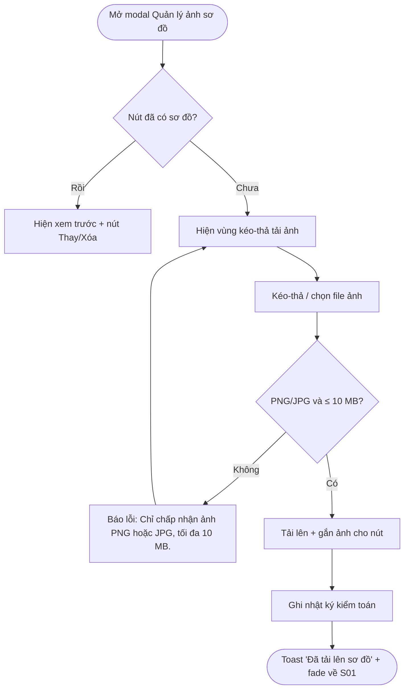
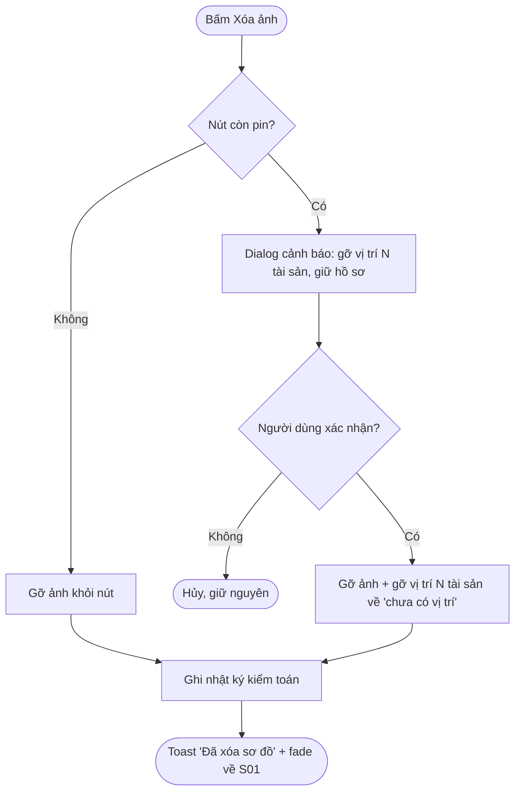
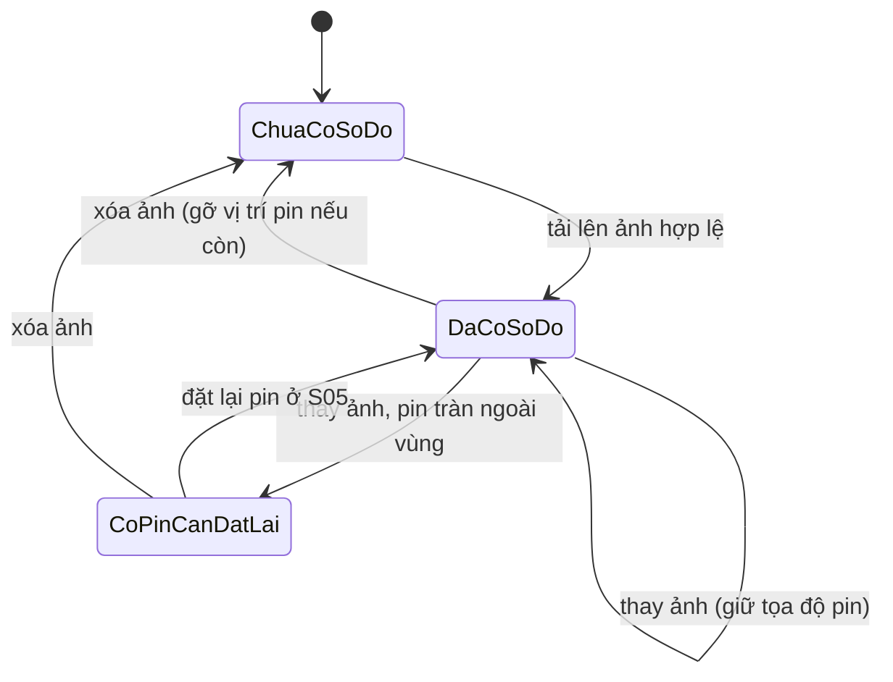
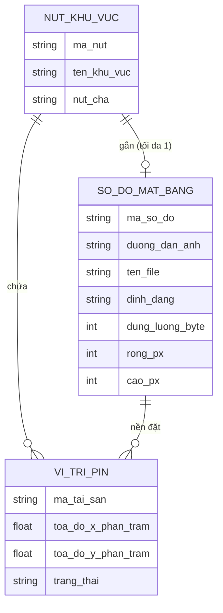

# Đặc tả yêu cầu — Quản lý ảnh sơ đồ mặt bằng (Mã màn: S03)

> Màn hình là **modal trượt lên (slide-up)** gắn với một **nút khu vực đang chọn** ở Bản đồ tài sản (S01). Vào từ menu nút "Quản lý ảnh sơ đồ" (chỉ Quản trị); ra fade về S01.

## Chức năng & truy vết nguồn
Modal quản lý một ảnh sơ đồ cho nút khu vực. Trace:
- F06 Tải lên ảnh sơ đồ → FR-02 → BR-02
- F07 Thay ảnh sơ đồ → FR-02 → BR-02
- F08 Xóa ảnh sơ đồ → FR-02 → BR-02

## Yêu cầu chức năng (Functional)
| Mã | Yêu cầu (hệ thống phải...) | Trace F/FR | Acceptance criteria (đo được) | Ưu tiên |
|----|----------------------------|------------|-------------------------------|---------|
| R-S03-01 | Cho phép Quản trị tải lên một ảnh sơ đồ mặt bằng cho nút khu vực chưa có sơ đồ | F06 / FR-02 | Kéo-thả hoặc chọn file PNG/JPG ≤ 10 MB → ảnh gắn vào nút; mở lại S01 thấy ảnh + cho phép đặt pin; ghi nhật ký kiểm toán | Must |
| R-S03-02 | Giới hạn **mỗi nút khu vực có tối đa 1 sơ đồ** | F06 / FR-02 | Nút đã có sơ đồ → ẩn vùng tải mới, chỉ cho Thay/Xóa; không tạo ảnh thứ hai | Must |
| R-S03-03 | Kiểm tra định dạng và dung lượng file trước khi tải lên | F06 / FR-02 | File không phải PNG/JPG hoặc > 10 MB → báo lỗi inline, **không** tải lên; file hợp lệ → cho phép tải | Must |
| R-S03-04 | Cho phép Quản trị thay ảnh sơ đồ của nút đã có sơ đồ, **giữ nguyên tọa độ tương đối (%)** của pin hiện có | F07 / FR-02 | Chọn ảnh mới hợp lệ → ảnh cũ thay bằng ảnh mới; pin giữ nguyên tọa độ %; nút còn pin → dialog cảnh báo trước khi thay; ghi nhật ký kiểm toán | Must |
| R-S03-05 | Sau khi thay ảnh, đánh dấu **"cần đặt lại vị trí"** cho pin nằm ngoài vùng ảnh mới và dẫn lối sang S05 | F07 / FR-02 | Pin có tọa độ % nằm ngoài tỉ lệ vùng ảnh mới → đánh dấu "cần đặt lại"; thông báo số pin tràn + nút "Đặt lại ngay" → S05 | Must |
| R-S03-06 | Cho phép Quản trị xóa ảnh sơ đồ của nút; nếu còn pin thì cảnh báo và **gỡ vị trí** tài sản (về "chưa có vị trí"), giữ hồ sơ tài sản | F08 / FR-02 | Nút còn pin → dialog ghi rõ số tài sản bị gỡ vị trí; xác nhận → ảnh bị gỡ, pin biến mất, tài sản về "chưa có vị trí", hồ sơ giữ nguyên; ghi nhật ký kiểm toán | Should |
| R-S03-07 | Hiển thị xem trước ảnh hiện tại kèm tên file, dung lượng, kích thước và số pin đang đặt | F06, F07 / FR-02 | Nút đã có sơ đồ → hiện ảnh + metadata + "N pin đang đặt" | Should |
| R-S03-08 | Đóng modal trả về workspace S01 mà không lưu thao tác đang dang dở | F06 / FR-02 | Bấm ✕/Đóng/Hủy → modal đóng, fade về S01, không thay đổi ảnh hiện trạng | Must |

## Yêu cầu phi chức năng (Non-functional)
| Mã | Loại | Yêu cầu đo được | Trace |
|----|------|-----------------|-------|
| R-S03-N01 | Tương thích dữ liệu | Chỉ chấp nhận ảnh **PNG/JPG**, mỗi file **≤ 10 MB** | NFR-04 / BR-02 |
| R-S03-N02 | Khả dụng (toàn vẹn vị trí) | Pin lưu **tọa độ tương đối (%)**; thay ảnh **giữ nguyên** tọa độ %, không làm lệch pin trong vùng ảnh mới | NFR-06 / BR-02 |
| R-S03-N03 | Bảo mật & truy vết | Mọi thao tác tải/thay/xóa ảnh được ghi **nhật ký kiểm toán** (người · hành động · nút · thời gian); **chỉ Quản trị** thực hiện | NFR-03 / BR-03 |
| R-S03-N04 | Hiệu năng | Modal mở và hiển thị ảnh xem trước trong **< 2 giây**; phản hồi kết quả tải lên sau khi nhận file | NFR-01 / BR-02 |

## Quy tắc nghiệp vụ (Business Rules)
| Mã | Quy tắc | Trace |
|----|---------|-------|
| BRule-S03-01 | Mỗi nút khu vực có **tối đa 1 sơ đồ mặt bằng** | R-S03-02 |
| BRule-S03-02 | Ảnh sơ đồ chỉ chấp nhận **PNG/JPG**, dung lượng **≤ 10 MB** | R-S03-03, R-S03-N01 |
| BRule-S03-03 | Khi **thay** ảnh cho nút đã có pin: **giữ nguyên tọa độ tương đối (%)** của pin trên ảnh mới (kế thừa BRule-04) | R-S03-04, R-S03-N02 |
| BRule-S03-04 | Pin có tọa độ % **nằm ngoài vùng ảnh mới** sau khi thay ảnh bị đánh dấu **"cần đặt lại vị trí"** (kế thừa BRule-05, GĐ-R2) → xử lý ở S05 | R-S03-05 |
| BRule-S03-05 | **Xóa** ảnh của nút còn pin: cảnh báo rồi **gỡ vị trí** tài sản (về "chưa có vị trí"), **không** xóa hồ sơ tài sản | R-S03-06 |
| BRule-S03-06 | **Chỉ Quản trị** được tải/thay/xóa ảnh sơ đồ; Giám sát không có lối vào màn (kế thừa BRule-09) | R-S03-01, R-S03-04, R-S03-06 |

## Yêu cầu dữ liệu — Validation từng field
| Field | Kiểu | Bắt buộc | Định dạng/Ràng buộc | Min/Max | Thông báo lỗi |
|-------|------|----------|---------------------|---------|---------------|
| file_anh | tệp ảnh | Có (khi tải/thay) | đuôi & kiểu MIME thuộc **PNG/JPG** | ≤ **10 MB** | "Chỉ chấp nhận ảnh PNG hoặc JPG, tối đa 10 MB." |
| nut_khu_vuc | tham chiếu | Có | là nút đang chọn ở S01 | — | "Vui lòng chọn một khu vực trước khi quản lý ảnh sơ đồ." |
| xac_nhan_thay | hành động | Có (khi nút còn pin) | xác nhận giữ tọa độ tương đối | — | — (chỉ hiển thị cảnh báo, không phải lỗi) |
| xac_nhan_xoa | hành động | Có (khi nút còn pin) | xác nhận gỡ vị trí N tài sản | — | — (chỉ hiển thị cảnh báo, không phải lỗi) |

- Đầu ra: nút khu vực có/không có ảnh sơ đồ cập nhật; pin giữ tọa độ tương đối khi thay ảnh; danh sách pin "cần đặt lại vị trí" (nếu có) chờ xử lý ở S05; bản ghi nhật ký kiểm toán cho thao tác tải/thay/xóa.

## Sơ đồ luồng (Flow)

### Luồng 1 — Tải lên ảnh sơ đồ (Activity)


### Luồng 2 — Thay ảnh giữ tọa độ pin (Sequence)
```mermaid
sequenceDiagram
  actor U as Quản trị
  participant FE as Modal Quản lý ảnh
  participant BE as Hệ thống
  U->>FE: Bấm Thay ảnh + chọn file mới
  FE->>FE: Kiểm tra PNG/JPG ≤ 10 MB
  alt Nút còn pin
    FE-->>U: Dialog 'Giữ tọa độ tương đối, pin tràn ngoài sẽ cần đặt lại'
    U->>FE: Xác nhận Tiếp tục thay
  end
  FE->>BE: Gửi ảnh mới (giữ tọa độ % của pin)
  BE->>BE: Thay ảnh + giữ tọa độ %; đánh dấu pin tràn ngoài 'cần đặt lại'
  BE->>BE: Ghi nhật ký kiểm toán
  BE-->>FE: Kết quả + số pin tràn ngoài
  FE-->>U: Toast 'Đã thay ảnh' (+ 'N pin cần đặt lại' → S05)
```

### Luồng 3 — Xóa ảnh sơ đồ (Activity)


### Luồng 4 — Trạng thái sơ đồ của nút (State)


## Mô hình dữ liệu màn hình (ERD)


## Thuật ngữ
| Thuật ngữ | Giải thích |
|-----------|-----------|
| R-S (yêu cầu cấp màn) | Yêu cầu của riêng màn này (R-S03-01…), truy vết F/FR |
| BRule (Business Rule) | Quy tắc nghiệp vụ áp cho màn (BRule-S03-01…) |
| Sơ đồ mặt bằng (floor plan) | Ảnh bố trí của một khu vực, dùng làm nền đính pin; mỗi nút khu vực có tối đa một sơ đồ |
| Tọa độ tương đối | Vị trí pin lưu theo phần trăm (%) kích thước ảnh, giữ vị trí khi đổi ảnh/đổi kích thước hiển thị |
| Pin "cần đặt lại vị trí" | Pin có tọa độ % nằm ngoài vùng ảnh mới sau khi thay ảnh, chờ đặt lại tọa độ ở S05 |
| Vùng kéo-thả (drop zone) | Khu vực giao diện nhận file ảnh bằng kéo-thả hoặc chọn từ máy |
| Nhật ký kiểm toán (audit log) | Bản ghi ai – làm gì – khi nào cho mọi thao tác tải/thay/xóa ảnh, phục vụ truy vết |

> Từ điển đầy đủ toàn dự án: `docs/00-glossary.md`.
