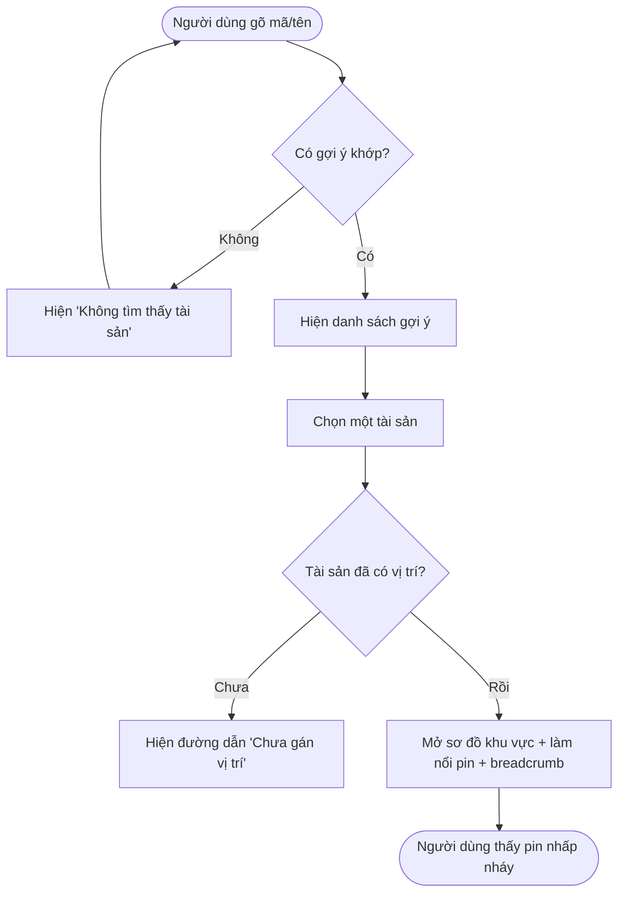
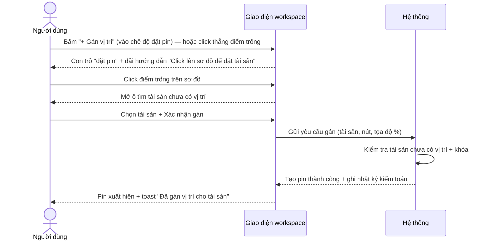
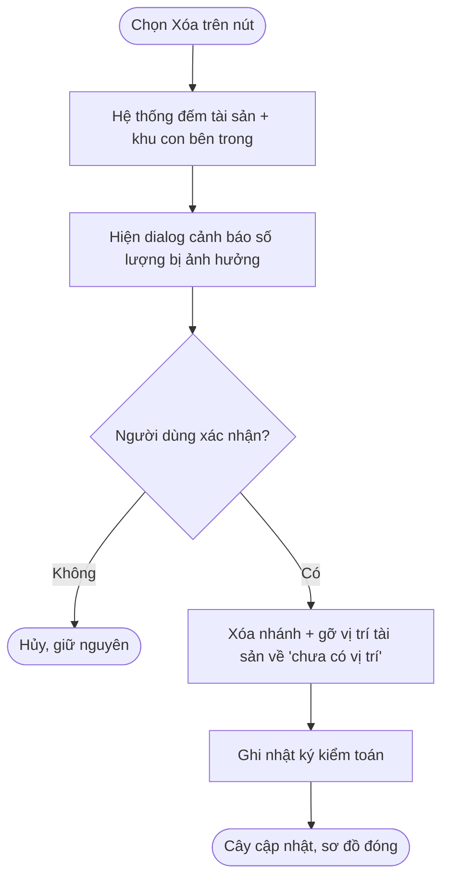
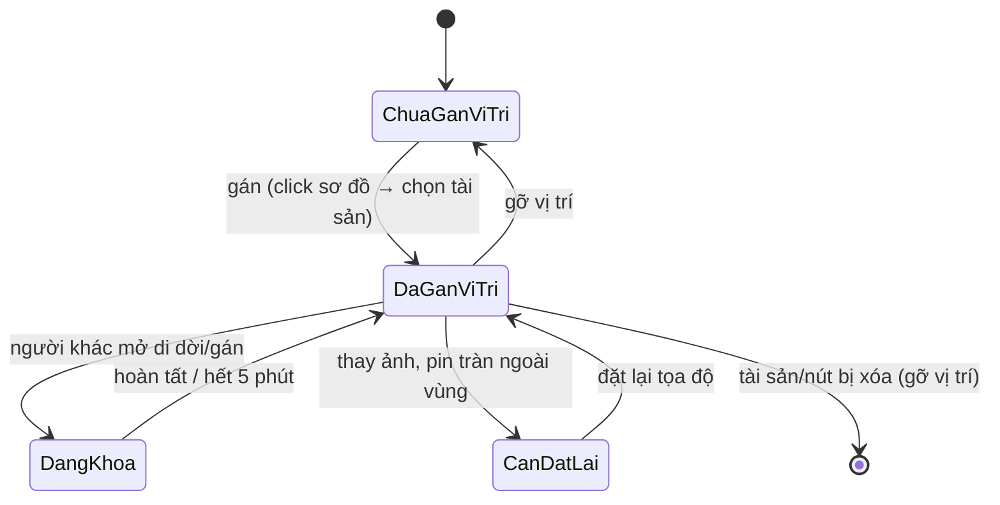
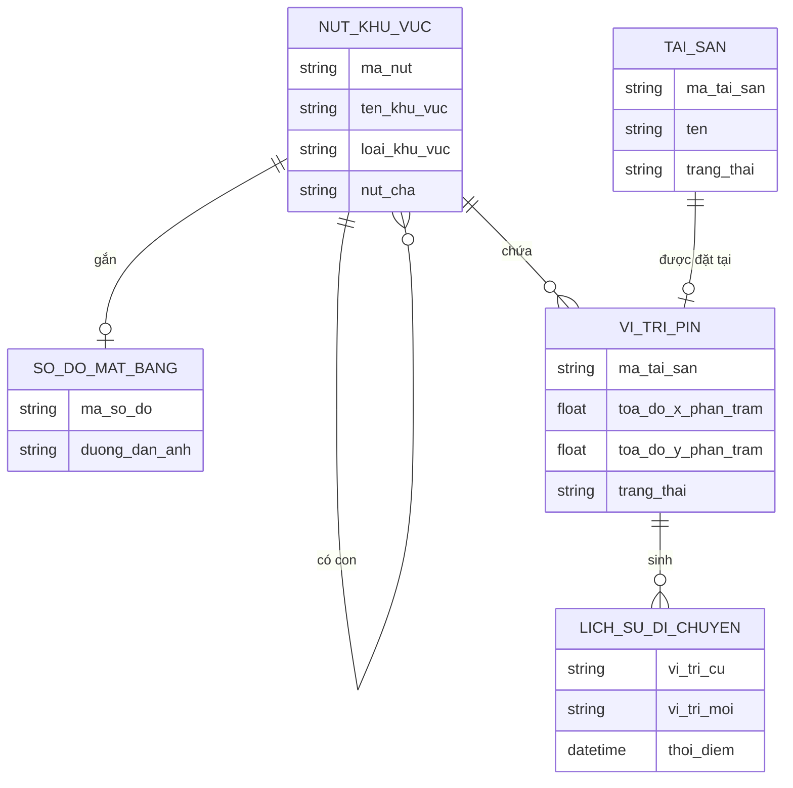

# Đặc tả yêu cầu — Bản đồ tài sản (Workspace) (Mã màn: S01)

## Chức năng & truy vết nguồn
Màn hub tích hợp nhiều chức năng. Trace:
- F04 Xem/duyệt cây khu vực → FR-01 → BR-04
- F05 Di chuyển nút trong cây → FR-01 → BR-04
- F09 Xem sơ đồ mặt bằng → FR-02 → BR-02
- F10 Gom cụm/lọc pin → FR-13 → BR-02
- F11 Gán vị trí tài sản → FR-03 → BR-01
- F14 Gỡ vị trí tài sản → FR-03 → BR-01
- F16 Tra cứu nhanh tài sản → FR-04 → BR-01
- F03 Xóa nút khu vực → FR-01, FR-12 → BR-04

## Yêu cầu chức năng (Functional)
| Mã | Yêu cầu (hệ thống phải...) | Trace F/FR | Acceptance criteria (đo được) | Ưu tiên |
|----|----------------------------|------------|-------------------------------|---------|
| R-S01-01 | Hiển thị cây khu vực phân cấp, mở/đóng từng nhánh | F04 / FR-01 | Cây hiển thị đúng quan hệ cha-con; click ▾/▸ mở/đóng nhánh; lồng được không giới hạn cấp | Must |
| R-S01-02 | Mở sơ đồ mặt bằng của nút khi người dùng chọn nút | F09 / FR-02 | Click nút → khung giữa hiển thị ảnh sơ đồ + pin của nút trong < 2s; nút chưa có ảnh → hiện trạng thái "Chưa có sơ đồ" | Must |
| R-S01-03 | Cho phép tra cứu tài sản theo mã/tên và nhảy tới làm nổi pin | F16 / FR-04 | Gõ ≥1 ký tự → gợi ý khớp một phần, không phân biệt dấu, trả về < 1s; chọn kết quả → tự mở sơ đồ, làm nổi pin, hiện breadcrumb đường dẫn | Must |
| R-S01-04 | Hiển thị pin tài sản trên sơ đồ theo tọa độ tương đối | F09 / FR-02 | Mỗi pin đúng vị trí tương đối (%) khi zoom/pan/đổi kích thước; click pin → popup chi tiết (mã, tên, trạng thái, đường dẫn) | Must |
| R-S01-05 | Gom cụm pin khi sơ đồ vượt 500 điểm và cho lọc pin | F10 / FR-13 | Khi > 500 pin/sơ đồ, pin gần nhau gộp thành cụm hiển thị số lượng; click cụm → tách/zoom; bộ lọc thu hẹp pin hiển thị | Should |
| R-S01-06 | Gán vị trí: có **nút "+ Gán vị trí"** trên thanh công cụ (điểm vào trực quan, bật *chế độ đặt pin*) **và/hoặc** click trực tiếp điểm trống → chọn tài sản chưa có vị trí → tạo pin | F11 / FR-03 | Thanh công cụ có CTA **"+ Gán vị trí"**; bấm → vào *chế độ đặt vị trí*: con trỏ đổi dạng "đặt pin" + dải hướng dẫn "Click lên sơ đồ để đặt tài sản" (có nút **Thoát**). Trong chế độ này, hoặc khi click thẳng điểm trống, → mở ô tìm chỉ liệt kê tài sản **chưa có vị trí**; chọn + xác nhận → pin xuất hiện tại tọa độ click; ghi nhật ký kiểm toán | Must |
| R-S01-07 | Gỡ vị trí tài sản qua popup pin (có xác nhận) | F14 / FR-03 | Popup pin có nút Gỡ; xác nhận → pin biến mất, tài sản về "chưa có vị trí"; ghi nhật ký kiểm toán | Should |
| R-S01-08 | Di chuyển nút trong cây bằng kéo-thả, chặn tạo vòng lặp | F05 / FR-01 | Kéo nút sang nhánh khác → cập nhật cha; **chặn** thả nút vào chính nó hoặc nhánh con của nó, báo lỗi | Should |
| R-S01-09 | Xóa nút khu vực với hộp xác nhận cảnh báo số lượng bị ảnh hưởng | F03 / FR-12 | Chọn Xóa → dialog hiện số tài sản bị gỡ vị trí + số khu con bị xóa; xác nhận → xóa nhánh, gỡ vị trí tài sản (không xóa hồ sơ); ghi nhật ký kiểm toán | Must |
| R-S01-10 | Điều hướng tới các màn vệ tinh từ workspace | F09 / FR-02 | Có lối vào S02 (thêm/sửa nút), S03 (ảnh sơ đồ), S04 (di dời/di dời hàng loạt), S05 (pin cần đặt lại), S06 (lịch sử), S08 (xuất báo cáo) | Must |
| R-S01-11 | Empty-state khi sơ đồ **đã có ảnh nhưng chưa có pin nào**: gợi ý cách đặt tài sản đầu tiên | F11 / FR-03 | Nút đã có ảnh sơ đồ và **0 pin** → khung sơ đồ hiện lớp gợi ý "Chưa có tài sản nào trên sơ đồ — bấm **'+ Gán vị trí'** rồi click lên sơ đồ để đặt tài sản đầu tiên"; lớp ẩn ngay khi có ≥1 pin. (Giám sát vẫn thấy — vai trò này được phép gán) | Should |

## Yêu cầu phi chức năng (Non-functional)
| Mã | Loại | Yêu cầu đo được | Trace |
|----|------|-----------------|-------|
| R-S01-N01 | Hiệu năng | Mở sơ đồ + render pin trong **< 2 giây**; hệ thống chịu tới **50.000 tài sản** | NFR-01 / BR-01 |
| R-S01-N02 | Hiệu năng | Tra cứu trả gợi ý trong **< 1 giây** | NFR-02 / BR-01 |
| R-S01-N03 | Bảo mật & truy vết | Mọi thao tác gán/gỡ/xóa ghi nhật ký kiểm toán đầy đủ; áp quyền 2 vai trò | NFR-03 / BR-03 |
| R-S01-N04 | Toàn vẹn đồng thời | Tài sản đang được người khác sửa bị khóa; pin hiển thị trạng thái khóa; tự mở sau 5 phút | NFR-05 / BR-03 |

## Quy tắc nghiệp vụ (Business Rules)
| Mã | Quy tắc | Trace |
|----|---------|-------|
| BRule-S01-01 | Ô gán vị trí chỉ liệt kê tài sản **chưa có vị trí** (mỗi tài sản chỉ 1 vị trí) | R-S01-06 |
| BRule-S01-02 | Chặn di chuyển một nút vào chính nó hoặc nhánh con của nó | R-S01-08 |
| BRule-S01-03 | Xóa nút còn tài sản/khu con: cho xóa, gỡ vị trí tài sản (về "chưa có vị trí"), không xóa hồ sơ tài sản | R-S01-09 |
| BRule-S01-04 | Vai trò **Giám sát** không thấy thao tác quản lý cấu trúc (Thêm/Sửa/Xóa nút, tải/thay/xóa ảnh); vẫn gán/gỡ/di dời/tra cứu | R-S01-01, R-S01-09 |
| BRule-S01-05 | Pin lưu **tọa độ tương đối (%)**; pin tràn ngoài vùng ảnh mới bị đánh dấu "cần đặt lại" | R-S01-04 |
| BRule-S01-06 | Nút "+ Gán vị trí" và *chế độ đặt pin* chỉ là **điểm vào trực quan** cho cùng thao tác gán; vẫn áp BRule-S01-01 (ô chọn chỉ liệt kê tài sản chưa có vị trí). Gán cho tài sản **đã có vị trí** = di dời (ghi lịch sử, BRule-02 cấp dự án) | R-S01-06, R-S01-11 |

## Yêu cầu dữ liệu — Validation từng field
| Field | Kiểu | Bắt buộc | Định dạng/Ràng buộc | Min/Max | Thông báo lỗi |
|-------|------|----------|---------------------|---------|---------------|
| tu_khoa_tra_cuu | chuỗi | Không | khớp một phần mã/tên, không phân biệt dấu | 1–100 ký tự | "Nhập tối đa 100 ký tự" |
| toa_do_pin_x | số (%) | Có (khi gán) | trong khoảng vùng ảnh | 0–100 | "Vị trí nằm ngoài sơ đồ" |
| toa_do_pin_y | số (%) | Có (khi gán) | trong khoảng vùng ảnh | 0–100 | "Vị trí nằm ngoài sơ đồ" |
| tai_san_chon | tham chiếu | Có (khi gán) | thuộc danh sách tài sản **chưa có vị trí** | — | "Vui lòng chọn một tài sản chưa có vị trí" |

- Đầu ra: cây khu vực đã render; sơ đồ + tập pin của nút đang chọn; kết quả tra cứu (đường dẫn + pin làm nổi); các thay đổi gán/gỡ/xóa được lưu và ghi nhật ký kiểm toán.

## Sơ đồ luồng (Flow)

### Luồng 1 — Tra cứu nhanh tài sản (Activity)

### Luồng 2 — Gán vị trí tài sản (Sequence)

### Luồng 3 — Xóa nút khu vực (Activity)

### Luồng 4 — Trạng thái pin trên sơ đồ (State)

## Mô hình dữ liệu màn hình (ERD)

## Thuật ngữ
| Thuật ngữ | Giải thích |
|-----------|-----------|
| R-S (yêu cầu cấp màn) | Yêu cầu của riêng màn này (R-S01-01…), truy vết F/FR |
| BRule (Business Rule) | Quy tắc nghiệp vụ áp cho màn (BRule-S01-01…) |
| Workspace (hub) | Màn trung tâm tích hợp cây khu vực + sơ đồ + pin |
| Pin | Điểm đánh dấu vị trí tài sản trên sơ đồ mặt bằng |
| Breadcrumb | Dải đường dẫn thể hiện vị trí nút trong cây khu vực |
| Clustering (gom cụm) | Gộp nhiều pin gần nhau thành một cụm khi vượt 500 điểm |

> Từ điển đầy đủ toàn dự án: `docs/00-glossary.md`.
