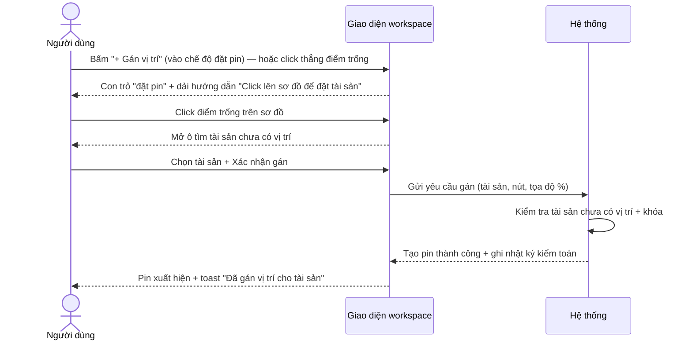
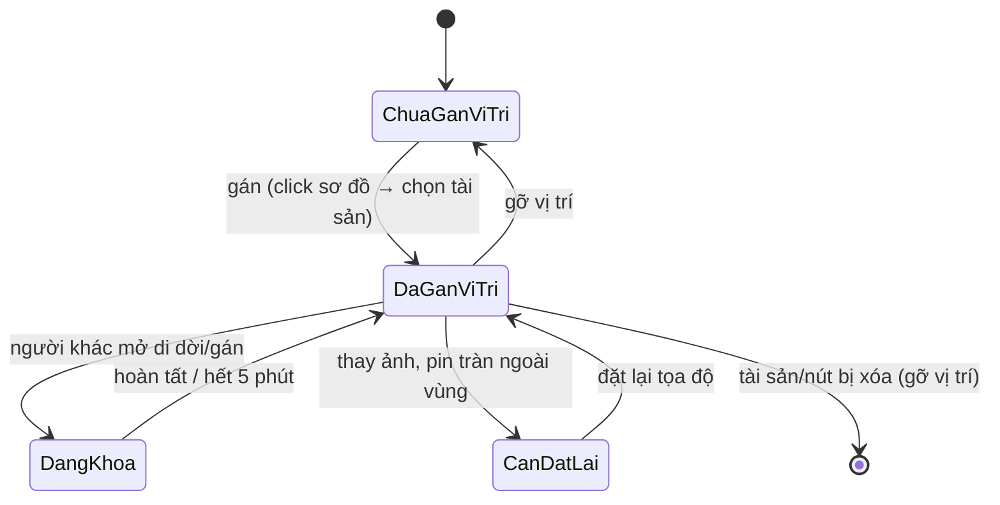
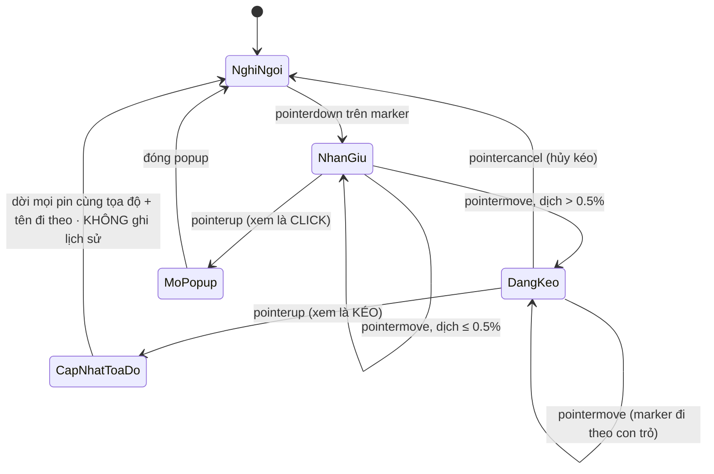
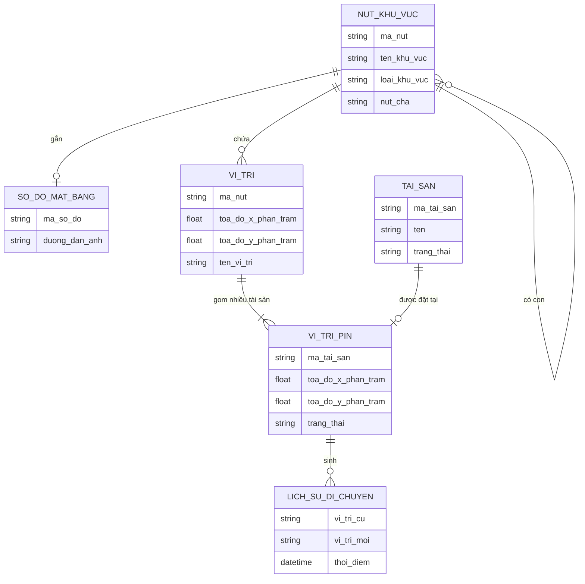

# Đặc tả yêu cầu — Bản đồ tài sản (Workspace) (Mã màn: S01)

## Chức năng & truy vết nguồn
Màn hub tích hợp nhiều chức năng. Trace:
- F04 Xem/duyệt cây khu vực → FR-01 → BR-04
- F05 Di chuyển nút trong cây → FR-01 → BR-04
- F09 Xem sơ đồ mặt bằng → FR-02 → BR-02
- F10 Gom cụm/lọc pin → FR-13 → BR-02
- F11 Gán vị trí tài sản → FR-03 → BR-01
- F14 Gỡ vị trí tài sản → FR-03 → BR-01
- F16 Tra cứu nhanh tài sản → FR-04 → BR-01
- F03 Xóa nút khu vực → FR-01, FR-12 → BR-04
- F04 Tìm/lọc cây khu vực theo tên/mã → FR-01 → BR-04 (bổ sung: ô tìm nhánh)

## Yêu cầu chức năng (Functional)
| Mã | Yêu cầu (hệ thống phải...) | Trace F/FR | Acceptance criteria (đo được) | Ưu tiên |
|----|----------------------------|------------|-------------------------------|---------|
| R-S01-01 | Hiển thị cây khu vực phân cấp, mở/đóng từng nhánh | F04 / FR-01 | Cây hiển thị đúng quan hệ cha-con; click ▾/▸ mở/đóng nhánh; lồng được không giới hạn cấp | Must |
| R-S01-02 | Mở sơ đồ mặt bằng của nút khi người dùng chọn nút | F09 / FR-02 | Click nút → khung giữa hiển thị ảnh sơ đồ + pin của nút trong < 2s; nút chưa có ảnh → hiện trạng thái "Chưa có sơ đồ" | Must |
| R-S01-03 | Cho phép tra cứu tài sản theo mã/tên và nhảy tới làm nổi pin | F16 / FR-04 | Gõ ≥1 ký tự → gợi ý khớp một phần, không phân biệt dấu, trả về < 1s; chọn kết quả → tự mở sơ đồ, làm nổi pin, hiện breadcrumb đường dẫn | Must |
| R-S01-04 | Hiển thị pin tài sản trên sơ đồ theo tọa độ tương đối | F09 / FR-02 | Mỗi pin đúng vị trí tương đối (%) khi zoom/pan/đổi kích thước; click pin → popup chi tiết (mã, tên, trạng thái, đường dẫn) | Must |
| R-S01-05 | Gom cụm pin khi sơ đồ vượt 500 điểm và cho lọc pin | F10 / FR-13 | Khi > 500 pin/sơ đồ, pin gần nhau gộp thành cụm hiển thị số lượng; click cụm → tách/zoom; bộ lọc thu hẹp pin hiển thị | Should |
| R-S01-06 | Gán vị trí: có **nút "+ Gán vị trí"** trên thanh công cụ (điểm vào trực quan, bật *chế độ đặt pin*) **và/hoặc** click trực tiếp điểm trống → chọn tài sản chưa có vị trí → tạo pin | F11 / FR-03 | Thanh công cụ có CTA **"+ Gán vị trí"**; bấm → vào *chế độ đặt vị trí*: con trỏ đổi dạng "đặt pin" + dải hướng dẫn "Click lên sơ đồ để đặt tài sản" (có nút **Thoát**). Trong chế độ này, hoặc khi click thẳng điểm trống, → mở ô tìm chỉ liệt kê tài sản **chưa có vị trí**; chọn + xác nhận → pin xuất hiện tại tọa độ click; ghi nhật ký kiểm toán | Must |
| R-S01-07 | Gỡ vị trí tài sản qua popup pin (có xác nhận) | F14 / FR-03 | Popup pin có nút Gỡ; xác nhận → pin biến mất, tài sản về "chưa có vị trí"; ghi nhật ký kiểm toán | Should |
| R-S01-08 | Di chuyển nút trong cây bằng kéo-thả, chặn tạo vòng lặp | F05 / FR-01 | Kéo nút sang nhánh khác → cập nhật cha; **chặn** thả nút vào chính nó hoặc nhánh con của nó, báo lỗi | Should |
| R-S01-09 | Xóa nút khu vực với hộp xác nhận cảnh báo số lượng bị ảnh hưởng | F03 / FR-12 | Chọn Xóa → dialog hiện số tài sản bị gỡ vị trí + số khu con bị xóa; xác nhận → xóa nhánh, gỡ vị trí tài sản (không xóa hồ sơ); ghi nhật ký kiểm toán | Must |
| R-S01-10 | Điều hướng tới các màn vệ tinh từ workspace | F09 / FR-02 | Có lối vào S02 (thêm/sửa nút), S03 (ảnh sơ đồ), S04 (di dời/di dời hàng loạt), S05 (pin cần đặt lại), S06 (lịch sử), S08 (xuất báo cáo) | Must |
| R-S01-11 | Empty-state khi sơ đồ **đã có ảnh nhưng chưa có pin nào**: gợi ý cách đặt tài sản đầu tiên | F11 / FR-03 | Nút đã có ảnh sơ đồ và **0 pin** → khung sơ đồ hiện lớp gợi ý "Chưa có tài sản nào trên sơ đồ — bấm **'+ Gán vị trí'** rồi click lên sơ đồ để đặt tài sản đầu tiên"; lớp ẩn ngay khi có ≥1 pin. (Giám sát vẫn thấy — vai trò này được phép gán) | Should |
| R-S01-12 | **Một vị trí chứa nhiều tài sản**: click điểm trống → ô gán **đa chọn** (checkbox) có **ô tìm** (mã/tên không dấu) + giới hạn hiển thị 50 + dòng đếm "N kết quả · Đã chọn M"; chọn ≥1 tài sản + Gán → mọi tài sản gắn vào **cùng tọa độ** | F11 / FR-03 | Ô gán hiện checkbox đa chọn; gõ ô tìm → lọc danh sách tài sản chưa có vị trí (không dấu); chỉ hiển thị tối đa 50 dòng đầu kèm chú thích "gõ để thu hẹp"; dòng đếm "N kết quả · Đã chọn M" cập nhật theo thao tác; nút "Gán vị trí (M)" disable khi M=0; xác nhận → tạo M pin cùng tọa độ, ghi nhật ký kiểm toán mỗi tài sản; toast "Đã gán vị trí cho M tài sản" | Must |
| R-S01-13 | **Popup danh sách tài sản tại một vị trí**: click một vị trí → popup liệt kê mọi tài sản tại đó, mỗi tài sản có **Xem lịch sử / Di dời / Gỡ vị trí**; có nút **"+ Gán thêm tài sản vào vị trí này"** | F11, F14 / FR-03 | Click marker → popup liệt kê đủ N tài sản tại tọa độ đó; mỗi dòng có 3 thao tác (Xem lịch sử→S06, Di dời→S04, Gỡ vị trí có xác nhận); nút "+ Gán thêm…" mở lại ô gán tại đúng tọa độ (ẩn khi không còn tài sản chưa có vị trí); gỡ hết tài sản → popup tự đóng | Must |
| R-S01-14 | **Đặt/đổi tên vị trí**: ô "Tên vị trí (tùy chọn)" ở đầu ô gán; đổi tên trong popup vị trí (ô + nút **"Lưu tên"**); tên lưu theo **(nút + tọa độ)** và hiển thị trên marker | F11 / FR-03 | Ô gán có trường "Tên vị trí (tùy chọn)"; popup vị trí có ô tên + "Lưu tên"; lưu → tên thành nhãn marker; tên rỗng khi lưu → xóa tên (toast "Đã xóa tên vị trí"); tên gắn theo cặp (maNut, x, y), không lẫn giữa các vị trí | Should |
| R-S01-15 | **Kéo-thả marker dời tọa độ trong cùng sơ đồ**: giữ + kéo marker → cập nhật tọa độ **mọi tài sản tại vị trí đó** (tên đi theo); hỗ trợ chuột + cảm ứng (Pointer Events); phân biệt click (mở popup) với kéo (dịch > 0,5%); **không** sinh lịch sử di chuyển | F11 / FR-03 | Giữ + kéo marker → mọi pin cùng tọa độ dời theo; thả → tọa độ % cập nhật, tên vị trí đi kèm; dịch ≤ 0,5% xem là click (mở popup), > 0,5% xem là kéo (không mở popup); chạy cả chuột (nút trái) lẫn chạm; thao tác này **không** ghi lịch sử di chuyển (khác "Di dời" đổi nút khu vực) | Should |
| R-S01-16 | **Marker nhất quán**: 1 và nhiều tài sản đều hiển thị "chấm tròn + số bên trong + nhãn"; nhãn = tên vị trí / mã tài sản / "N tài sản"; có vòng mờ ngoài; màu theo trạng thái (xanh=bình thường, xám=đang khóa, vàng=cần đặt lại) | F09, F10 / FR-02 | Marker đơn và marker nhiều tài sản dùng chung dạng chấm tròn có số ở giữa + nhãn dưới; nhãn ưu tiên tên vị trí, kế đến mã tài sản (khi 1), cuối cùng "N tài sản" (khi >1); màu chấm đổi theo trạng thái; có vòng mờ bao quanh | Should |
| R-S01-17 | **Tìm/lọc cây khu vực theo tên/mã** (không dấu): ô "Tìm khu vực theo tên/mã..." → chỉ hiện nhánh khớp + tổ tiên, **tự bung**; nút **"Bung tất cả" / "Thu gọn"**; cây mặc định thu gọn | F04 / FR-01 | Gõ ô tìm → ẩn nhánh không khớp, hiện nhánh khớp + toàn bộ tổ tiên, các nhánh này tự bung; xóa lọc → trở về trạng thái mặc định (thu gọn); "Bung tất cả" mở mọi nhánh, "Thu gọn" đóng hết; khớp không phân biệt dấu trên tên và mã khu vực | Should |
| R-S01-18 | **Dấu hiệu "đã có sơ đồ"** trong cây: nút đã gắn ảnh sơ đồ hiện icon bản đồ cạnh tên (tooltip "Đã có sơ đồ mặt bằng") | F04, F09 / FR-02 | Mỗi nút có `soDoUrl` hiển thị icon bản đồ nhỏ cạnh tên; hover icon → tooltip "Đã có sơ đồ mặt bằng"; nút chưa có ảnh không hiện icon | Could |
| R-S01-19 | **Chú thích màu vị trí** ở góc khung sơ đồ: Bình thường / Đang khóa / Cần đặt lại | F09 / FR-02 | Khung sơ đồ có chú thích cố định 3 màu (xanh/ xám/ vàng) kèm nhãn tương ứng; không che thao tác đặt pin | Could |

## Yêu cầu phi chức năng (Non-functional)
| Mã | Loại | Yêu cầu đo được | Trace |
|----|------|-----------------|-------|
| R-S01-N01 | Hiệu năng | Mở sơ đồ + render pin trong **< 2 giây**; hệ thống chịu tới **50.000 tài sản** | NFR-01 / BR-01 |
| R-S01-N02 | Hiệu năng | Tra cứu trả gợi ý trong **< 1 giây** | NFR-02 / BR-01 |
| R-S01-N03 | Bảo mật & truy vết | Mọi thao tác gán/gỡ/xóa ghi nhật ký kiểm toán đầy đủ; áp quyền 2 vai trò | NFR-03 / BR-03 |
| R-S01-N04 | Toàn vẹn đồng thời | Tài sản đang được người khác sửa bị khóa; pin hiển thị trạng thái khóa; tự mở sau 5 phút | NFR-05 / BR-03 |
| R-S01-N05 | Hiển thị — pin dính đúng điểm khi co giãn | Ảnh + pin nằm trong hộp khớp **tỉ lệ ảnh thật** (aspect-ratio theo kích thước tự nhiên của ảnh); pin định vị bằng **tọa độ tương đối %** của hộp → **không lệch** ở mọi kích thước màn/zoom | NFR-01 / BR-02 |
| R-S01-N06 | Responsive — mobile (≤768px) | Màn hẹp: nút **hamburger ☰** mở **drawer** cây khu vực phủ trên nội dung + **nền tối (scrim)**; chọn một nút → drawer tự đóng; ô tra cứu chiếm **full-width**; modal/panel chiếm gần **full màn** | NFR-04 / BR-02 |

## Quy tắc nghiệp vụ (Business Rules)
| Mã | Quy tắc | Trace |
|----|---------|-------|
| BRule-S01-01 | Ô gán vị trí chỉ liệt kê tài sản **chưa có vị trí** (mỗi tài sản chỉ 1 vị trí) | R-S01-06 |
| BRule-S01-02 | Chặn di chuyển một nút vào chính nó hoặc nhánh con của nó | R-S01-08 |
| BRule-S01-03 | Xóa nút còn tài sản/khu con: cho xóa, gỡ vị trí tài sản (về "chưa có vị trí"), không xóa hồ sơ tài sản | R-S01-09 |
| BRule-S01-04 | Vai trò **Giám sát** không thấy thao tác quản lý cấu trúc (Thêm/Sửa/Xóa nút, tải/thay/xóa ảnh); vẫn gán/gỡ/di dời/tra cứu | R-S01-01, R-S01-09 |
| BRule-S01-05 | Pin lưu **tọa độ tương đối (%)**; pin tràn ngoài vùng ảnh mới bị đánh dấu "cần đặt lại" | R-S01-04 |
| BRule-S01-06 | Nút "+ Gán vị trí" và *chế độ đặt pin* chỉ là **điểm vào trực quan** cho cùng thao tác gán; vẫn áp BRule-S01-01 (ô chọn chỉ liệt kê tài sản chưa có vị trí). Gán cho tài sản **đã có vị trí** = di dời (ghi lịch sử, BRule-02 cấp dự án) | R-S01-06, R-S01-11 |
| BRule-S01-07 | **Một vị trí gom được nhiều tài sản** (cùng một cặp tọa độ trên một nút) — vẫn tương thích BRule-S01-01: mỗi tài sản chỉ thuộc **một** vị trí, nhưng nhiều tài sản được phép chia sẻ cùng một vị trí | R-S01-12, R-S01-13 |
| BRule-S01-08 | **Kéo-thả marker** chỉ chỉnh tọa độ trong **cùng một nút khu vực** → **không** sinh lịch sử di chuyển. Khác hẳn "Di dời" (đổi nút khu vực) — thao tác đổi nút mới ghi lịch sử (BRule-02 cấp dự án) | R-S01-15 |
| BRule-S01-09 | **Tên vị trí** lưu theo cặp **(nút khu vực + tọa độ x,y %)**; khi kéo-thả dời tọa độ, tên **đi theo** vị trí mới; tên rỗng = không đặt tên (marker hiển thị nhãn mặc định: mã tài sản / "N tài sản") | R-S01-14, R-S01-15 |

## Yêu cầu dữ liệu — Validation từng field
| Field | Kiểu | Bắt buộc | Định dạng/Ràng buộc | Min/Max | Thông báo lỗi |
|-------|------|----------|---------------------|---------|---------------|
| tu_khoa_tra_cuu | chuỗi | Không | khớp một phần mã/tên, không phân biệt dấu | 1–100 ký tự | "Nhập tối đa 100 ký tự" |
| toa_do_pin_x | số (%) | Có (khi gán) | trong khoảng vùng ảnh | 0–100 | "Vị trí nằm ngoài sơ đồ" |
| toa_do_pin_y | số (%) | Có (khi gán) | trong khoảng vùng ảnh | 0–100 | "Vị trí nằm ngoài sơ đồ" |
| tai_san_chon | tập tham chiếu (đa chọn) | Có (khi gán) | mỗi phần tử thuộc danh sách tài sản **chưa có vị trí**; ≥1 phần tử | 1–N | "Vui lòng chọn ít nhất một tài sản chưa có vị trí" |
| tim_gan (ô tìm trong ô gán) | chuỗi | Không | khớp một phần mã/tên tài sản chưa có vị trí, không phân biệt dấu | 0–100 ký tự | — (chỉ thu hẹp danh sách; không khớp → "Không tìm thấy tài sản phù hợp") |
| ten_vi_tri | chuỗi | Không | tên hiển thị cho vị trí; rỗng = xóa tên | 0–100 ký tự | — |
| tim_cay (ô tìm cây khu vực) | chuỗi | Không | khớp một phần tên/mã khu vực, không phân biệt dấu | 0–100 ký tự | — (không khớp → cây trống nhánh; xóa lọc để hiện lại) |

- Đầu ra: cây khu vực đã render; sơ đồ + tập pin của nút đang chọn; kết quả tra cứu (đường dẫn + pin làm nổi); các thay đổi gán/gỡ/xóa được lưu và ghi nhật ký kiểm toán.

## Sơ đồ luồng (Flow)

### Luồng 1 — Tra cứu nhanh tài sản (Activity)


### Luồng 2 — Gán vị trí tài sản (Sequence)


### Luồng 3 — Xóa nút khu vực (Activity)


### Luồng 4 — Trạng thái pin trên sơ đồ (State)


### Luồng 5 — Gán nhiều tài sản vào một vị trí (Activity)
```mermaid
flowchart TD
  A([Click điểm trống trên sơ đồ]) --> B[Mở ô gán: trường Tên vị trí + ô tìm + danh sách checkbox]
  B --> C[Ô tìm lọc tài sản CHƯA có vị trí, không dấu, hiển thị tối đa 50]
  C --> D{Đã chọn ≥1 tài sản?}
  D -- Không --> E[Nút 'Gán vị trí' disable] --> C
  D -- Có --> F[Dòng đếm 'N kết quả · Đã chọn M']
  F --> G[Bấm 'Gán vị trí (M)']
  G --> H[Tạo M pin CÙNG tọa độ + ghi nhật ký mỗi tài sản]
  H --> I{Có nhập Tên vị trí?}
  I -- Có --> J[Lưu tên theo nút+tọa độ → nhãn marker]
  I -- Không --> K[Marker nhãn mặc định 'M tài sản']
  J --> L([Toast 'Đã gán vị trí cho M tài sản'])
  K --> L
```

### Luồng 6 — Kéo-thả marker dời vị trí trong cùng sơ đồ (State)


## Mô hình dữ liệu màn hình (ERD)


## Thuật ngữ
| Thuật ngữ | Giải thích |
|-----------|-----------|
| R-S (yêu cầu cấp màn) | Yêu cầu của riêng màn này (R-S01-01…), truy vết F/FR |
| BRule (Business Rule) | Quy tắc nghiệp vụ áp cho màn (BRule-S01-01…) |
| Workspace (hub) | Màn trung tâm tích hợp cây khu vực + sơ đồ + pin |
| Pin | Điểm đánh dấu vị trí tài sản trên sơ đồ mặt bằng |
| Breadcrumb | Dải đường dẫn thể hiện vị trí nút trong cây khu vực |
| Clustering (gom cụm) | Gộp nhiều pin gần nhau thành một cụm khi vượt 500 điểm |
| Vị trí (gom nhiều tài sản) | Một điểm tọa độ trên sơ đồ; có thể chứa nhiều tài sản, mỗi tài sản vẫn chỉ thuộc một vị trí |
| Tên vị trí | Nhãn tùy chọn đặt cho một vị trí, lưu theo (nút khu vực + tọa độ), hiển thị trên marker |
| Marker | Chấm tròn + số tài sản + nhãn, thay cho "pin"; màu theo trạng thái vị trí |
| Kéo-thả pin (marker) | Giữ + kéo marker để dời tọa độ mọi tài sản tại vị trí đó trong cùng sơ đồ; không sinh lịch sử |
| Drawer | Ngăn trượt chứa cây khu vực, mở bằng nút hamburger trên màn hẹp (≤768px), kèm nền tối (scrim) |
| Scrim | Lớp nền tối phủ sau drawer/modal; chạm vào để đóng |
| Pointer Events | Sự kiện con trỏ hợp nhất chuột + cảm ứng, dùng cho thao tác kéo-thả marker |

> Từ điển đầy đủ toàn dự án: `docs/00-glossary.md`.
