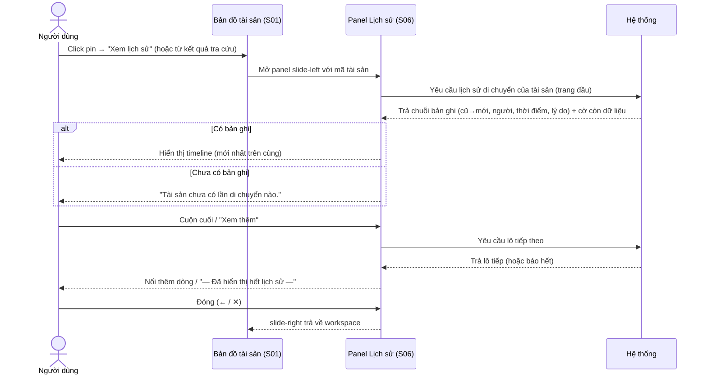
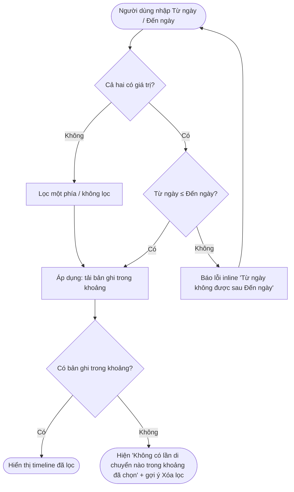
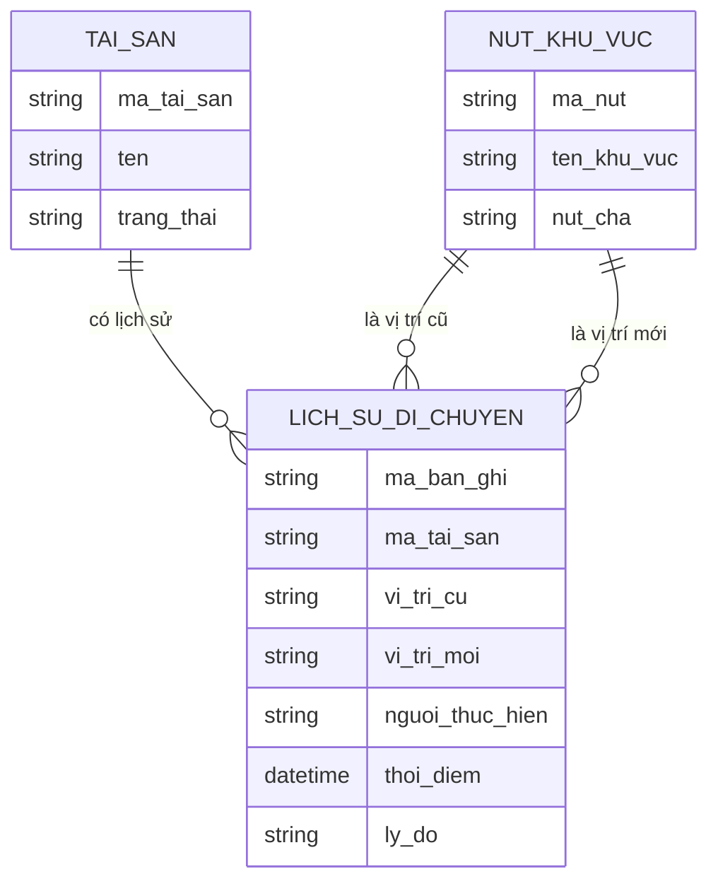

# Đặc tả yêu cầu — Lịch sử di chuyển tài sản (Mã màn: S06)

## Chức năng & truy vết nguồn
Panel chỉ đọc xem lịch sử di chuyển của MỘT tài sản. Trace:
- F17 Xem lịch sử di chuyển → FR-07 → BR-03

Phụ thuộc dữ liệu: bản ghi lịch sử do F12 (di dời đơn) và F13 (di dời hàng loạt) **tự sinh**; F11 (gán vị trí lần đầu) tạo bản ghi đầu đời. Màn này chỉ **đọc** (CRUD-R), không tạo/sửa/xóa.

## Yêu cầu chức năng (Functional)
| Mã | Yêu cầu (hệ thống phải...) | Trace F/FR | Acceptance criteria (đo được) | Ưu tiên |
|----|----------------------------|------------|-------------------------------|---------|
| R-S06-01 | Hiển thị chuỗi bản ghi di chuyển của MỘT tài sản theo thứ tự thời gian | F17 / FR-07 | Mở panel → liệt kê mọi bản ghi của tài sản, sắp xếp theo thời điểm giảm dần (mới nhất trên cùng); đúng tài sản được chọn từ S01 | Must |
| R-S06-02 | Mỗi bản ghi thể hiện: vị trí cũ → vị trí mới (đường dẫn khu vực đầy đủ), người thực hiện, thời điểm, lý do (nếu có) | F17 / FR-07 | Mỗi mục hiện đủ 4 thông tin; vị trí cũ/mới là breadcrumb đầy đủ; lý do trống → "(Không có lý do)"; bản ghi đầu đời → vị trí cũ "(Chưa có vị trí)" | Must |
| R-S06-03 | Mở panel slide-left từ S01 (popup pin "Xem lịch sử" hoặc kết quả tra cứu) và đóng slide-right về S01 | F17 / FR-07 | Có lối vào từ popup pin và từ kết quả tra cứu; nút đóng/← trả về S01 giữ nguyên ngữ cảnh trước đó | Must |
| R-S06-04 | Cho lọc lịch sử theo khoảng thời gian (Từ ngày – Đến ngày) | F17 / FR-07 | Nhập khoảng + Áp dụng → chỉ hiện bản ghi có thời điểm trong khoảng (bao gồm hai mốc); [Xóa lọc] → hiện lại toàn bộ | Should |
| R-S06-05 | Chặn lọc khi Từ ngày > Đến ngày và báo lỗi rõ ràng | F17 / FR-07 | Khi Từ ngày > Đến ngày → hiện lỗi inline, **không** gọi tải; sửa cho hợp lệ thì mới áp dụng được | Should |
| R-S06-06 | Trình bày trạng thái rỗng, rỗng-sau-lọc, lỗi tách bạch | F17 / FR-07 | Không có bản ghi nào → "Tài sản chưa có lần di chuyển nào."; có lịch sử nhưng khoảng lọc rỗng → "Không có lần di chuyển nào trong khoảng đã chọn."; lỗi tải → thông báo + "Thử lại" | Must |
| R-S06-07 | Phân trang / tải thêm khi lịch sử dài để giữ hiệu năng | F17 / FR-07 | Lịch sử vượt ngưỡng một trang → tải theo lô (cuộn vô hạn/Xem thêm); hết dữ liệu → "— Đã hiển thị hết lịch sử —" | Should |
| R-S06-08 | Không cung cấp thao tác sửa/xóa bản ghi lịch sử trên màn | F17 / FR-07 | Panel không có nút Sửa/Xóa cho bất kỳ bản ghi nào; toàn màn chỉ đọc với cả hai vai trò | Must |

## Yêu cầu phi chức năng (Non-functional)
| Mã | Loại | Yêu cầu đo được | Trace |
|----|------|-----------------|-------|
| R-S06-N01 | Hiệu năng | Tải & hiển thị trang lịch sử đầu (≤ 50 bản ghi) trong **< 2 giây**; mỗi lần tải thêm cũng < 2 giây, kể cả khi tài sản có hàng trăm bản ghi | NFR-01 / BR-03 |
| R-S06-N02 | Bảo mật & truy vết | Lịch sử phản ánh đúng dữ liệu truy vết (người · hành động · thời điểm · vị trí cũ→mới) khớp nhật ký kiểm toán; chỉ người đã đăng nhập (Quản trị/Giám sát) xem được | NFR-03 / BR-03 |
| R-S06-N03 | Tính nhất quán hiển thị | Thời điểm hiển thị theo múi giờ hệ thống, định dạng dd/MM/yyyy HH:mm thống nhất toàn panel | NFR-03 / BR-03 |

## Quy tắc nghiệp vụ (Business Rules)
| Mã | Quy tắc | Trace |
|----|---------|-------|
| BRule-S06-01 | Lịch sử di chuyển **bất biến (append-only)**: bản ghi đã tạo không sửa, không xóa; chỉ thêm mới khi di dời | R-S06-01, R-S06-08 |
| BRule-S06-02 | Mỗi lần gán/di dời tài sản (F11/F12/F13) sinh **đúng một** bản ghi lịch sử; lần gán đầu tiên có vị trí cũ là "(Chưa có vị trí)" | R-S06-01, R-S06-02 |
| BRule-S06-03 | **Cả Quản trị và Giám sát** đều xem được lịch sử; không vai trò nào sửa/xóa được | R-S06-03, R-S06-08 |
| BRule-S06-04 | Lý do di chuyển là **tùy chọn**; bản ghi không có lý do vẫn hợp lệ và hiển thị "(Không có lý do)" | R-S06-02 |
| BRule-S06-05 | Lịch sử gắn với **một** tài sản; panel luôn xem theo bối cảnh một tài sản được chọn, không trộn nhiều tài sản | R-S06-01 |

## Yêu cầu dữ liệu — Validation từng field
> Màn chỉ đọc — chỉ có bộ lọc khoảng thời gian cần kiểm tra đầu vào.

| Field | Kiểu | Bắt buộc | Định dạng/Ràng buộc | Min/Max | Thông báo lỗi |
|-------|------|----------|---------------------|---------|---------------|
| tu_ngay | ngày | Không | định dạng ngày hợp lệ; **≤ den_ngay** | không vượt ngày hiện tại | "Từ ngày không được sau Đến ngày" |
| den_ngay | ngày | Không | định dạng ngày hợp lệ; **≥ tu_ngay** | không vượt ngày hiện tại | "Đến ngày không được trước Từ ngày" |

- Quy tắc liên trường: chỉ một trong hai (chỉ Từ ngày, hoặc chỉ Đến ngày) cũng hợp lệ (lọc một phía); để trống cả hai = không lọc. Khi cả hai có giá trị, áp ràng buộc tu_ngay ≤ den_ngay.
- Đầu ra: danh sách bản ghi lịch sử của tài sản (đã/chưa lọc) — mỗi bản ghi gồm thời điểm, người thực hiện, đường dẫn vị trí cũ → mới, lý do (nếu có); cờ "còn dữ liệu để tải thêm".

## Sơ đồ luồng (Flow)

### Luồng 1 — Xem lịch sử di chuyển (Sequence)

### Luồng 2 — Lọc theo khoảng thời gian (Activity)

## Mô hình dữ liệu màn hình (ERD)

## Thuật ngữ
| Thuật ngữ | Giải thích |
|-----------|-----------|
| R-S (yêu cầu cấp màn) | Yêu cầu của riêng màn này (R-S06-01…), truy vết F/FR |
| BRule (Business Rule) | Quy tắc nghiệp vụ áp cho màn (BRule-S06-01…) |
| Lịch sử di chuyển | Chuỗi bản ghi vị trí cũ → mới của một tài sản theo thời gian |
| Append-only (chỉ thêm) | Dữ liệu chỉ được thêm mới, không sửa/không xóa bản ghi đã có |
| Bất biến (immutable) | Bản ghi đã tạo không thay đổi nội dung về sau |
| Breadcrumb | Dải đường dẫn khu vực đầy đủ thể hiện vị trí trong cây khu vực |

> Từ điển đầy đủ toàn dự án: `docs/00-glossary.md`.
