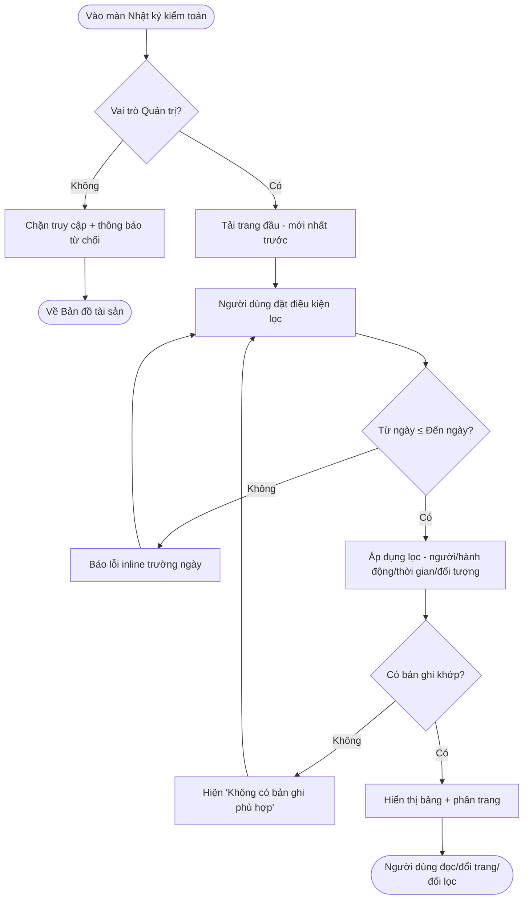
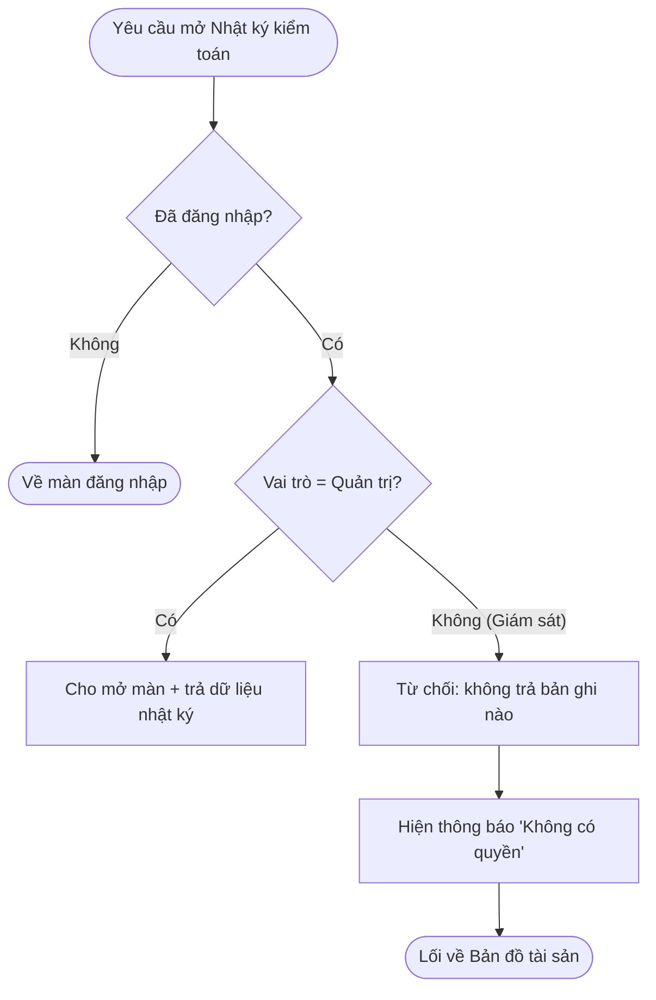
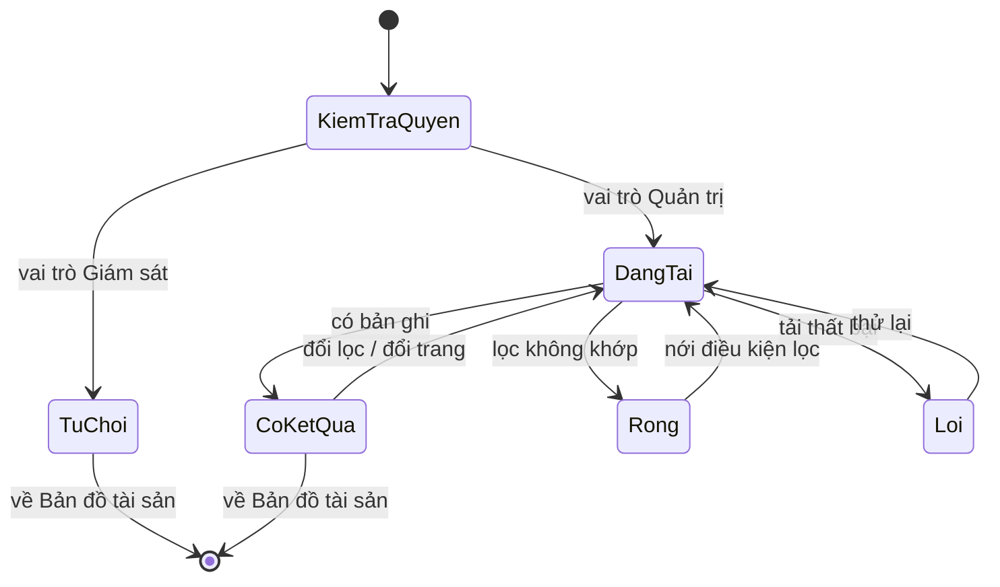
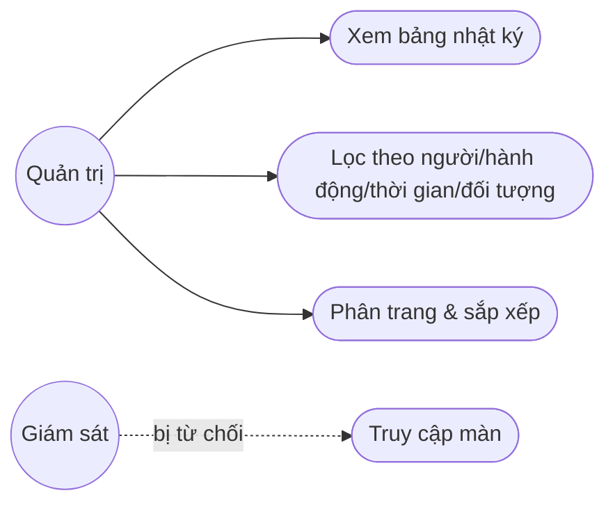
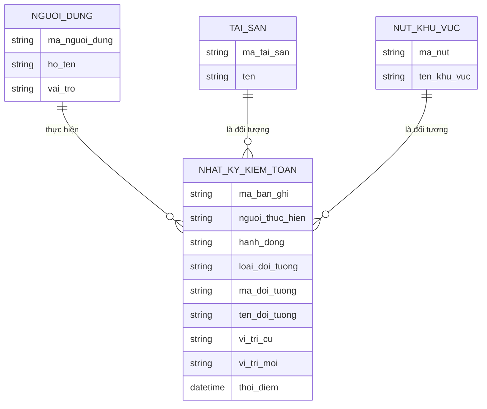

# Đặc tả yêu cầu — Nhật ký kiểm toán (Mã màn: S07)

## Chức năng & truy vết nguồn
Màn tra cứu & lọc nhật ký kiểm toán (chỉ đọc). Trace:
- F19 Xem nhật ký kiểm toán → FR-08 → BR-03

> Chức năng nền liên quan (không thuộc màn này): F18 Ghi nhật ký kiểm toán — tự động sinh bản ghi khi gán/di dời/xóa ở các màn khác. Màn S07 chỉ **tra, lọc, đọc** dữ liệu do F18 ghi ra.

## Yêu cầu chức năng (Functional)
| Mã | Yêu cầu (hệ thống phải...) | Trace F/FR | Acceptance criteria (đo được) | Ưu tiên |
|----|----------------------------|------------|-------------------------------|---------|
| R-S07-01 | Hiển thị bảng bản ghi nhật ký kiểm toán mọi thao tác gán/di dời/xóa | F19 / FR-08 | Mỗi dòng có đủ: thời điểm, người thực hiện, hành động, đối tượng, vị trí cũ→mới (nếu có); mặc định sắp xếp mới nhất trước | Must |
| R-S07-02 | Cho lọc theo **người thực hiện** | F19 / FR-08 | Chọn một người → bảng chỉ còn bản ghi của người đó; "Tất cả" → không lọc theo người | Must |
| R-S07-03 | Cho lọc theo **loại hành động** (Gán/Di dời/Xóa) | F19 / FR-08 | Chọn một loại → bảng chỉ còn bản ghi thuộc loại đó; "Tất cả" → mọi loại | Must |
| R-S07-04 | Cho lọc theo **khoảng thời gian** (Từ ngày – Đến ngày) | F19 / FR-08 | Chỉ trả bản ghi có thời điểm trong [Từ; Đến]; ràng buộc Từ ≤ Đến, báo lỗi nếu Từ > Đến | Must |
| R-S07-05 | Cho lọc theo **từ khóa đối tượng** (mã/tên tài sản hoặc tên nút khu vực) | F19 / FR-08 | Khớp một phần; bảng chỉ còn bản ghi có đối tượng khớp; từ khóa ≤ 100 ký tự | Must |
| R-S07-06 | Kết hợp nhiều điều kiện lọc (AND) và cho **Xóa lọc** về mặc định | F19 / FR-08 | Áp đồng thời các bộ lọc cho kết quả giao nhau; "Xóa lọc" đưa mọi điều kiện về mặc định và nạp lại bảng | Should |
| R-S07-07 | **Phân trang** kết quả khi số bản ghi lớn | F19 / FR-08 | Hiển thị tổng số bản ghi; chia trang (mặc định 25 dòng/trang); điều hướng Trước/Sau/số trang | Should |
| R-S07-08 | **Sắp xếp** theo cột Thời điểm (tăng/giảm) | F19 / FR-08 | Click tiêu đề cột Thời điểm → đảo thứ tự; trạng thái sắp xếp hiển thị rõ | Could |
| R-S07-09 | Quay lại Bản đồ tài sản (S01) từ màn nhật ký | F19 / FR-08 | Có nút quay lại → đóng panel, trở về S01 giữ nguyên ngữ cảnh trước đó | Must |

## Yêu cầu phi chức năng (Non-functional)
| Mã | Loại | Yêu cầu đo được | Trace |
|----|------|-----------------|-------|
| R-S07-N01 | Bảo mật & phân quyền | **Chỉ vai trò Quản trị** truy cập màn; vai trò Giám sát bị từ chối và **không nhận bất kỳ bản ghi nào** (chặn cả ở giao diện lẫn truy vấn dữ liệu) | NFR-03 / BR-03 |
| R-S07-N02 | Hiệu năng | Tải trang đầu (25 bản ghi) và áp một bộ lọc trả kết quả trong **< 2 giây** trên kho tới mức **50.000 tài sản** | NFR-01 / BR-03 |
| R-S07-N03 | Toàn vẹn dữ liệu (bất biến) | Dữ liệu kiểm toán là **append-only**: màn không cung cấp bất kỳ thao tác tạo/sửa/xóa bản ghi nào; nội dung bản ghi không đổi sau khi ghi | NFR-03 / BR-03 |
| R-S07-N04 | Truy vết đầy đủ | Mỗi bản ghi luôn hiển thị đủ trường truy vết: người · hành động · đối tượng · thời gian · vị trí cũ→mới (nếu có) | NFR-03 / BR-03 |

## Quy tắc nghiệp vụ (Business Rules)
| Mã | Quy tắc | Trace |
|----|---------|-------|
| BRule-S07-01 | Nhật ký kiểm toán là **append-only**: chỉ thêm khi có thao tác; **không sửa, không xóa** bản ghi qua bất kỳ giao diện nào | R-S07-01, R-S07-N03 |
| BRule-S07-02 | **Chỉ vai trò Quản trị** được xem nhật ký kiểm toán; Giám sát bị từ chối truy cập | R-S07-N01 |
| BRule-S07-03 | Mỗi bản ghi tương ứng đúng **một thao tác** gán/di dời/xóa do F18 ghi tự động; màn S07 không tự sinh bản ghi | R-S07-01 |
| BRule-S07-04 | Trường **Vị trí cũ → mới** chỉ áp cho thao tác **Gán** (cũ = "chưa có vị trí") và **Di dời**; thao tác **Xóa** để trống ("—") | R-S07-01, R-S07-N04 |
| BRule-S07-05 | Khoảng thời gian hợp lệ khi **Từ ≤ Đến**; vi phạm thì chặn áp dụng lọc | R-S07-04 |

## Yêu cầu dữ liệu — Validation từng field
| Field | Kiểu | Bắt buộc | Định dạng/Ràng buộc | Min/Max | Thông báo lỗi |
|-------|------|----------|---------------------|---------|---------------|
| nguoi_thuc_hien | tham chiếu | Không | một người dùng trong danh sách (hoặc "Tất cả") | — | — (chọn từ danh sách, không nhập tay) |
| loai_hanh_dong | liệt kê | Không | một trong: Gán / Di dời / Xóa (hoặc "Tất cả") | — | — (chọn từ danh sách) |
| tu_ngay | ngày | Không | ngày hợp lệ; ≤ đến_ngày | ≤ hôm nay | "Từ ngày phải nhỏ hơn hoặc bằng Đến ngày" |
| den_ngay | ngày | Không | ngày hợp lệ; ≥ từ_ngày | ≤ hôm nay | "Đến ngày phải lớn hơn hoặc bằng Từ ngày" |
| tu_khoa_doi_tuong | chuỗi | Không | khớp một phần mã/tên tài sản hoặc tên nút khu vực, không phân biệt dấu | 0–100 ký tự | "Nhập tối đa 100 ký tự" |

- Đầu ra: bảng bản ghi nhật ký kiểm toán (đã lọc/sắp xếp/phân trang) ở chế độ chỉ đọc; tổng số bản ghi khớp điều kiện; không phát sinh bất kỳ thay đổi dữ liệu nào.

## Sơ đồ luồng (Flow)

### Luồng 1 — Tra & lọc nhật ký kiểm toán (Activity)

### Luồng 2 — Phân quyền truy cập (Activity)

### Luồng 3 — Trạng thái màn nhật ký (State)

### Luồng 4 — Tác nhân ↔ chức năng (Use case)

## Mô hình dữ liệu màn hình (ERD)

## Thuật ngữ
| Thuật ngữ | Giải thích |
|-----------|-----------|
| R-S (yêu cầu cấp màn) | Yêu cầu của riêng màn này (R-S07-01…), truy vết F/FR |
| BRule (Business Rule) | Quy tắc nghiệp vụ áp cho màn (BRule-S07-01…) |
| Nhật ký kiểm toán (audit log) | Bản ghi ai–làm gì–khi nào cho mọi thao tác gán/di dời/xóa, phục vụ truy vết |
| Append-only (chỉ thêm) | Dữ liệu chỉ được thêm vào, không sửa và không xóa — đảm bảo bất biến để truy vết |
| Audit trail (vết kiểm toán) | Chuỗi bản ghi kiểm toán cho phép lần lại toàn bộ thao tác đã xảy ra |
| Đối tượng (của thao tác) | Thực thể bị tác động trong một thao tác: tài sản hoặc nút khu vực |

> Từ điển đầy đủ toàn dự án: `docs/00-glossary.md`.
