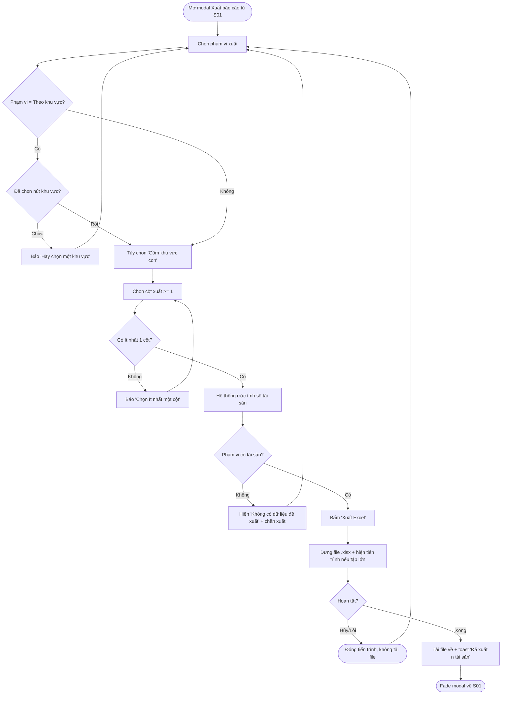
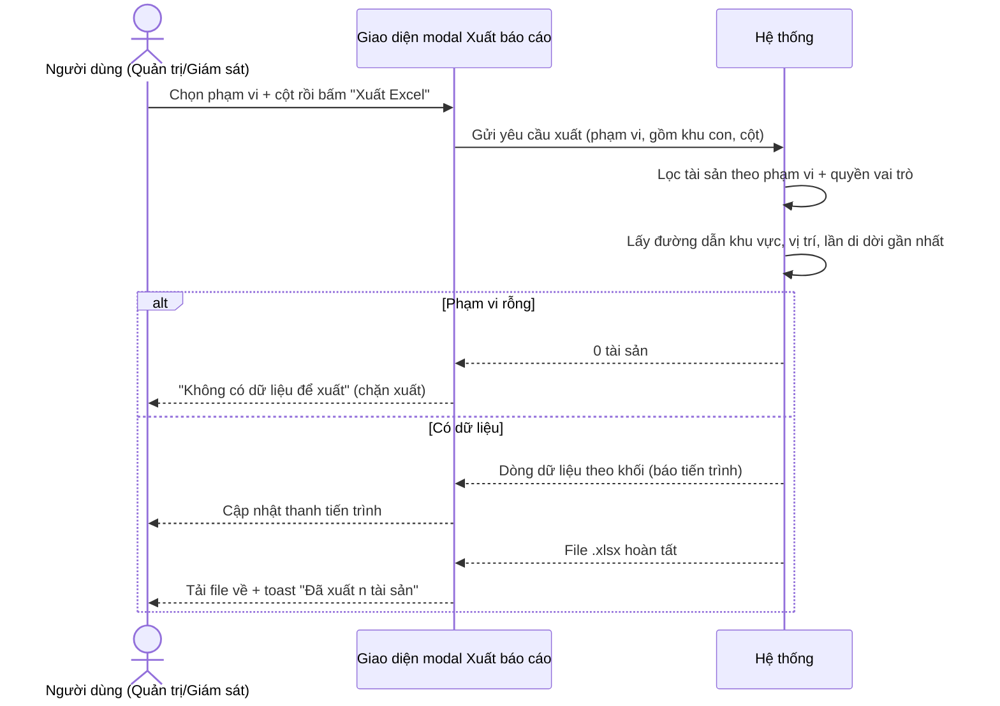
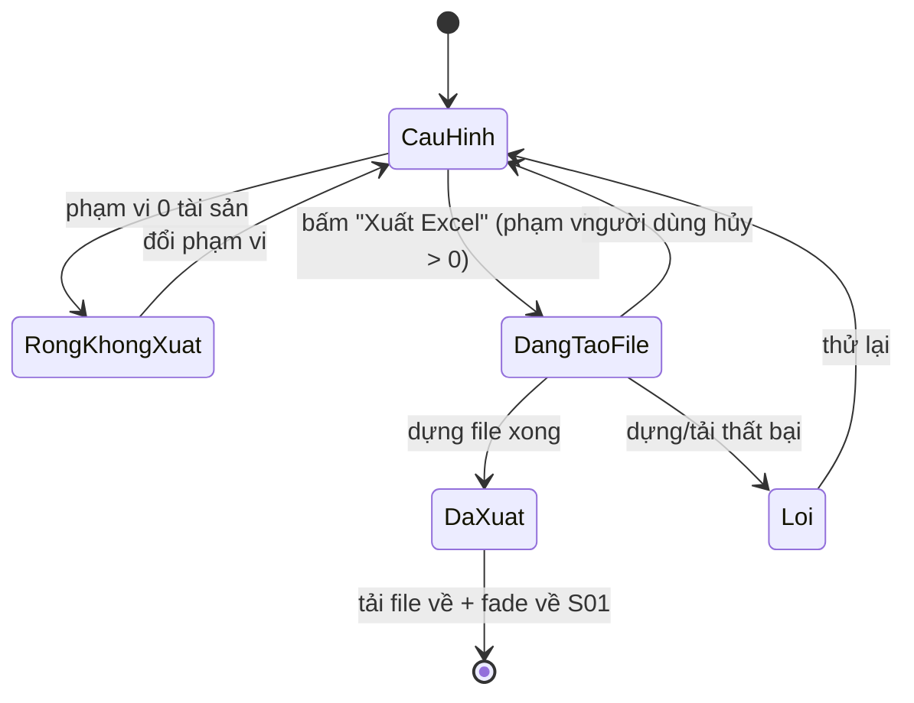
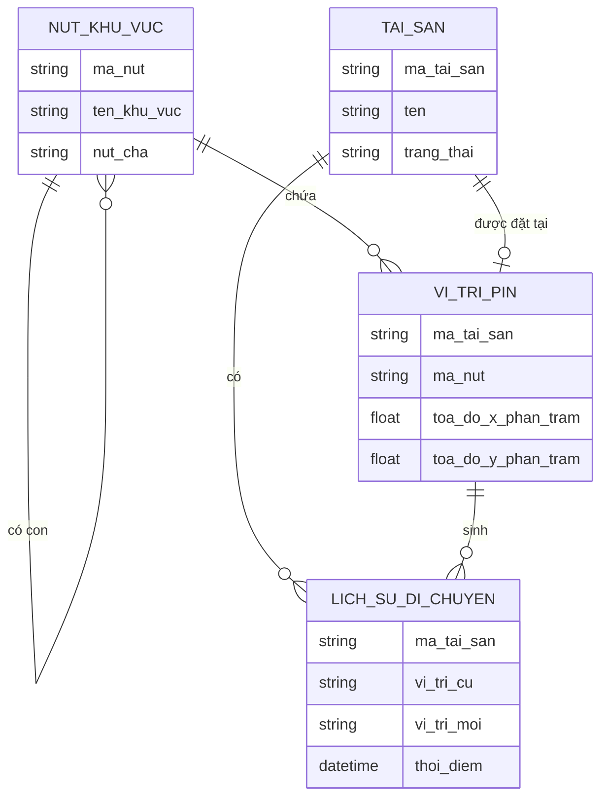

# Đặc tả yêu cầu — Xuất báo cáo / kiểm kê (Mã màn: S08)

## Chức năng & truy vết nguồn
Màn modal phục vụ một chức năng. Trace:
- F20 Xuất báo cáo / kiểm kê → FR-10 → BR-02

Nguồn liên quan: giả định **GĐ-R1** (`01-requirements.md`) đã xác nhận định dạng và cột báo cáo — Excel (.xlsx) gồm: mã tài sản, tên, đường dẫn khu vực, vị trí, lần di dời gần nhất.

## Yêu cầu chức năng (Functional)
| Mã | Yêu cầu (hệ thống phải...) | Trace F/FR | Acceptance criteria (đo được) | Ưu tiên |
|----|----------------------------|------------|-------------------------------|---------|
| R-S08-01 | Cho phép chọn **phạm vi xuất** theo một trong ba lựa chọn: toàn bộ tài sản / theo nút khu vực đang chọn / theo bộ lọc hiện tại | F20 / FR-10 | Có nhóm radio 3 lựa chọn; bắt buộc chọn đúng 1; mặc định "Theo khu vực đang chọn" nếu S01 có nút đang chọn, ngược lại "Toàn bộ" | Should |
| R-S08-02 | Khi chọn "Theo khu vực đang chọn", cho phép **gồm cả các khu vực con** | F20 / FR-10 | Có checkbox "Gồm cả các khu vực con" (mặc định bật); bật → phạm vi lấy tài sản của nút và toàn bộ nhánh con; tắt → chỉ tài sản đặt trực tiếp tại nút | Should |
| R-S08-03 | Cho phép **chọn cột xuất** trong tập: mã tài sản, tên, đường dẫn khu vực, vị trí, lần di dời gần nhất | F20 / FR-10 | 5 checkbox cột, mặc định tick hết; phải còn **≥ 1 cột**; cột bỏ tick không xuất hiện trong file | Should |
| R-S08-04 | **Ước tính số tài sản** trong phạm vi đã chọn trước khi xuất | F20 / FR-10 | Đổi phạm vi → dải ước tính cập nhật số dòng tương ứng; phạm vi rỗng hiển thị 0 | Should |
| R-S08-05 | **Xuất file Excel (.xlsx)** chứa các tài sản trong phạm vi với đúng các cột đã chọn, rồi tải về máy | F20 / FR-10 | Bấm "Xuất Excel" → tạo file .xlsx hợp lệ; mỗi dòng = 1 tài sản; cột đúng lựa chọn; "lần di dời gần nhất" lấy bản ghi mới nhất trong lịch sử di chuyển; file tải về tự động | Should |
| R-S08-06 | Hiển thị **tiến trình** khi xuất tập lớn và cho **hủy** giữa chừng | F20 / FR-10 | Tập > 5.000 dòng → hiện thanh tiến trình + số dòng đã xử lý; nút Hủy dừng và không tải file dở | Should |
| R-S08-07 | Báo **không có dữ liệu** khi phạm vi rỗng và **chặn xuất** | F20 / FR-10 | Phạm vi 0 tài sản → hiện "Không có dữ liệu để xuất"; nút "Xuất Excel" bị vô hiệu | Should |
| R-S08-08 | Cho phép **Quản trị và Giám sát** đều xuất; mở từ S01 và **đóng (fade) về S01** sau khi xuất xong hoặc hủy | F20 / FR-10 | Cả hai vai trò thấy và dùng được nút "Xuất báo cáo"; modal trượt lên từ S01; xuất xong/hủy → đóng modal về workspace | Should |

## Yêu cầu phi chức năng (Non-functional)
| Mã | Loại | Yêu cầu đo được | Trace |
|----|------|-----------------|-------|
| R-S08-N01 | Hiệu năng | Xuất được tập lớn tới **50.000 dòng** mà không treo giao diện; tập ≤ 5.000 dòng hoàn tất **< 5 giây** | NFR-01 / BR-02 |
| R-S08-N02 | Tương thích dữ liệu | File xuất đúng định dạng **Excel `.xlsx`** (Office Open XML), mở được trên Excel/LibreOffice; mã hóa Unicode (UTF-8) giữ đúng dấu tiếng Việt | BR-02 |
| R-S08-N03 | Khả dụng | Khi xuất tập lớn, xử lý **theo luồng/khối** để giao diện vẫn phản hồi (hiện tiến trình, cho hủy) | NFR-01 / BR-02 |
| R-S08-N04 | Bảo mật & truy vết | Phạm vi xuất tôn trọng quyền vai trò; chỉ xuất tài sản người dùng được phép xem | NFR-03 / BR-03 |

## Quy tắc nghiệp vụ (Business Rules)
| Mã | Quy tắc | Trace |
|----|---------|-------|
| BRule-S08-01 | File báo cáo có **các cột chuẩn** theo thứ tự cố định: mã tài sản → tên → đường dẫn khu vực → vị trí → lần di dời gần nhất; bỏ tick cột nào thì cột đó vắng nhưng thứ tự các cột còn lại giữ nguyên | R-S08-03, R-S08-05 |
| BRule-S08-02 | Phạm vi "Theo khu vực đang chọn" có bật "Gồm cả các khu vực con" thì gồm **tài sản của nút và toàn bộ nhánh con** (mọi cấp) | R-S08-02 |
| BRule-S08-03 | "Lần di dời gần nhất" lấy **thời điểm bản ghi lịch sử di chuyển mới nhất** của tài sản; tài sản chưa từng di dời → để trống | R-S08-05 |
| BRule-S08-04 | Tài sản **chưa có vị trí** vẫn được liệt kê nếu nằm trong phạm vi; cột "vị trí" và "đường dẫn khu vực" để trống/ghi "Chưa gán vị trí" | R-S08-05 |
| BRule-S08-05 | **Cả Quản trị và Giám sát** đều được xuất báo cáo (không giới hạn vai trò) | R-S08-08 |
| BRule-S08-06 | Định dạng đầu ra cố định là **Excel `.xlsx`** (theo GĐ-R1) | R-S08-05, R-S08-N02 |

## Yêu cầu dữ liệu — Validation từng field
| Field | Kiểu | Bắt buộc | Định dạng/Ràng buộc | Min/Max | Thông báo lỗi |
|-------|------|----------|---------------------|---------|---------------|
| pham_vi | enum | Có | một trong: `toan_bo` / `theo_khu_vuc` / `theo_bo_loc` | chọn đúng 1 | "Vui lòng chọn phạm vi xuất" |
| nut_khu_vuc_chon | tham chiếu | Có (khi `pham_vi = theo_khu_vuc`) | phải có một nút khu vực đang được chọn ở S01 | — | "Hãy chọn một khu vực trước khi xuất theo khu vực" |
| gom_khu_con | boolean | Không | chỉ áp dụng khi `pham_vi = theo_khu_vuc` | — | — |
| cot_xuat | danh sách | Có | tập con của 5 cột chuẩn, **≥ 1 cột** | 1–5 cột | "Chọn ít nhất một cột để xuất" |
| (kết quả phạm vi) | dẫn xuất | — | số tài sản trong phạm vi phải **> 0** mới cho xuất | ≥ 1 | "Không có dữ liệu để xuất" |

- Đầu ra: một file **Excel `.xlsx`** tải về máy, mỗi dòng là một tài sản trong phạm vi với các cột đã chọn; toast "Đã xuất {n} tài sản".

## Sơ đồ luồng (Flow)

### Luồng 1 — Chọn phạm vi & xuất Excel (Activity)

### Luồng 2 — Trao đổi tạo file (Sequence)

### Luồng 3 — Trạng thái quá trình xuất (State)

## Mô hình dữ liệu màn hình (ERD)

> "Lần di dời gần nhất" của mỗi tài sản = `thoi_diem` lớn nhất trong các bản ghi `LICH_SU_DI_CHUYEN` của tài sản đó; "đường dẫn khu vực" + "vị trí" dẫn từ `VI_TRI_PIN` → chuỗi `NUT_KHU_VUC` cha-con.

## Thuật ngữ
| Thuật ngữ | Giải thích |
|-----------|-----------|
| R-S (yêu cầu cấp màn) | Yêu cầu của riêng màn này (R-S08-01…), truy vết F/FR |
| BRule (Business Rule) | Quy tắc nghiệp vụ áp cho màn (BRule-S08-01…) |
| Phạm vi xuất | Tập tài sản đưa vào báo cáo: toàn bộ / theo nút khu vực đang chọn / theo bộ lọc hiện tại |
| Kiểm kê | Đối chiếu tài sản thực tế với sổ sách định kỳ; báo cáo này là dữ liệu đầu vào |
| Excel (.xlsx) | Định dạng bảng tính Office Open XML, mở được trên Excel/LibreOffice |
| Lần di dời gần nhất | Thời điểm bản ghi lịch sử di chuyển mới nhất của một tài sản |
| Đường dẫn khu vực | Chuỗi nút khu vực từ gốc tới nút chứa tài sản (vd Tòa A › Tầng 3 › Phòng 305) |

> Từ điển đầy đủ toàn dự án: `docs/00-glossary.md`.
